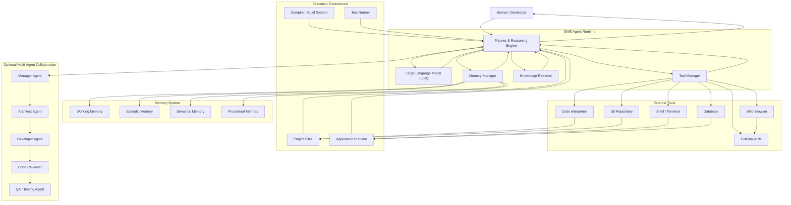
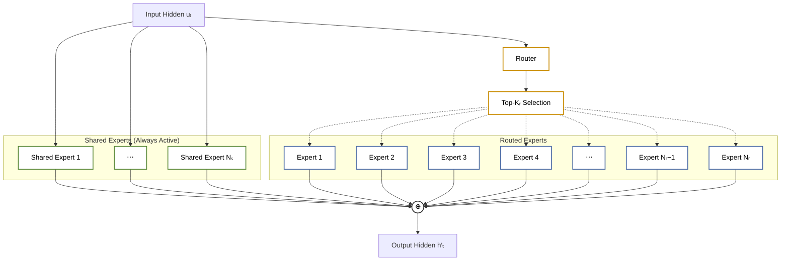
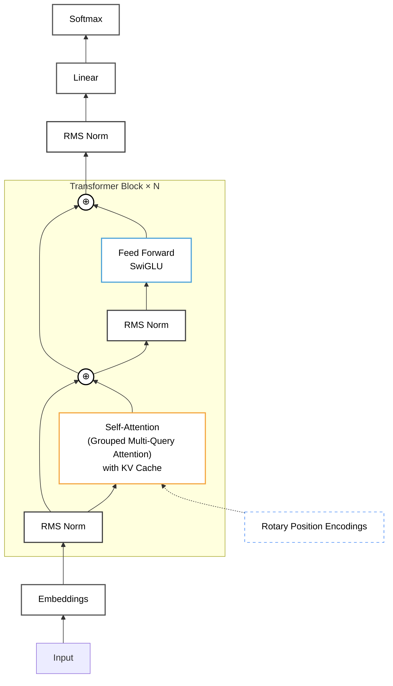
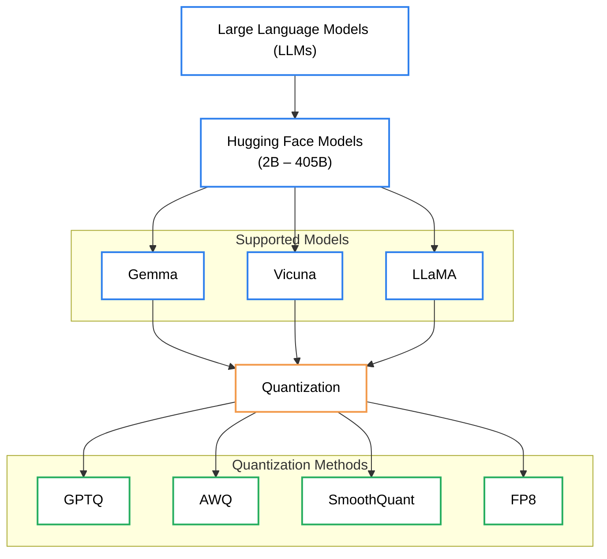
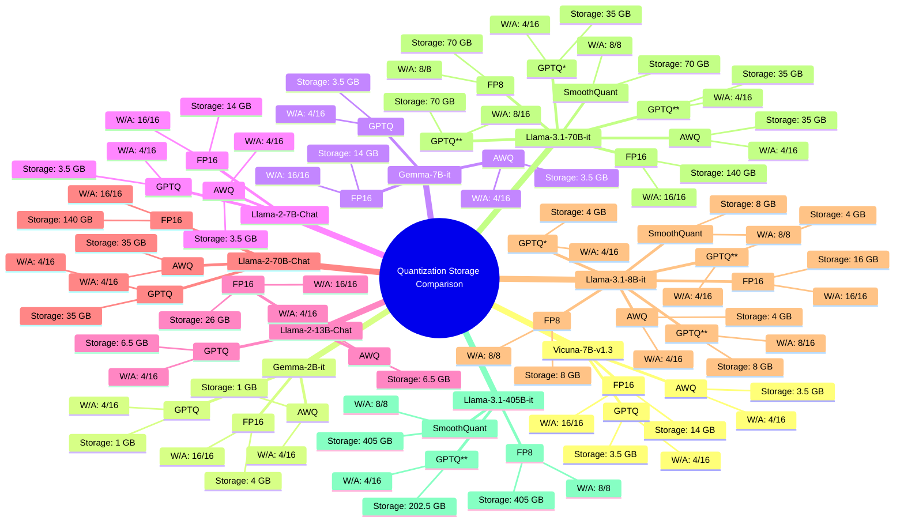
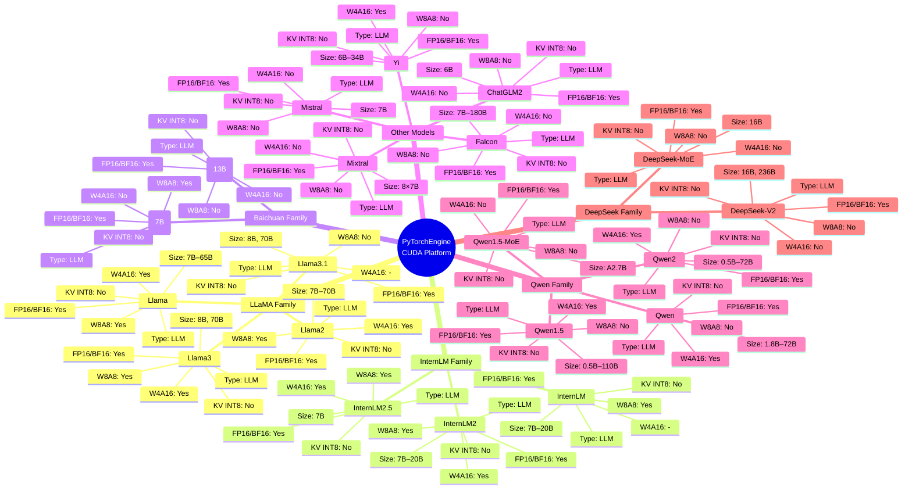

# Serving AI From the Basement

## A Real-World Case Study of Building an 8× RTX 3090 Local AI Server

---

# Chapter Introduction

Throughout the previous chapters, we focused on the theory behind running Large Language Models locally. We learned about model architectures, memory planning, quantization, runtimes, inference engines, memory bandwidth, hardware tiers, and the trade-offs involved in choosing the right system.

However, engineering is rarely learned from theory alone.

One of the fastest ways to understand how complex systems work is by studying the experiences of people who have already built them.

This chapter is different from the previous ones.

Instead of introducing new concepts through definitions and diagrams alone, we examine the real-world experience of a developer who built a dedicated multi-GPU AI server from scratch.

The purpose of this chapter is not to convince you to build an identical machine.

Instead, it demonstrates how experienced practitioners think when designing hardware for large language models.

Throughout this chapter, we will analyze the design decisions, engineering trade-offs, mistakes, and lessons learned while building a dedicated local AI server capable of running some of the largest publicly available language models.

Many of the technologies mentioned in this chapter—including PCIe lanes, NVLink, Tensor Parallelism, EPYC processors, RDIMM memory, inference engines, and enterprise hardware—may initially seem intimidating.

Do not worry if these terms are unfamiliar.

Each concept will be introduced and explained as it appears so that readers with little or no prior server experience can follow along comfortably.

Rather than treating this chapter as a hardware buying guide, think of it as a guided tour through a real engineering project.

Understanding why each decision was made is often more valuable than simply copying the hardware itself.

---

# Learning Objectives

By the end of this chapter, readers will be able to:

* Understand why large language model deployments eventually outgrow consumer hardware.
* Learn how experienced practitioners approach multi-GPU server design.
* Understand the reasoning behind selecting enterprise CPUs, motherboards, memory, and power supplies.
* Recognize why PCIe lanes, NVLink, and Tensor Parallelism become increasingly important as GPU counts increase.
* Learn about common mistakes encountered while building high-performance AI servers.
* Understand how software choices are just as important as hardware choices.
* Appreciate the practical engineering trade-offs involved in large-scale local AI deployments.

---

# 1. A Real-World Journey into Large-Scale Local AI

The material presented in this chapter is based on the experience of **Ahmad**, a member of the local AI community who publicly documented his journey of building a dedicated multi-GPU language model server.

Rather than presenting benchmark charts or theoretical recommendations, Ahmad shared the complete engineering process—from planning and hardware selection to assembly challenges, software experimentation, and lessons learned.

His project serves as an excellent real-world example because it demonstrates the kinds of decisions that eventually confront anyone attempting to move beyond a single consumer graphics card.

As language models continue growing larger, many enthusiasts eventually encounter the same question:

> **"What happens when one GPU is no longer enough?"**

This chapter explores one possible answer.

---

# 1.1 Why Build a Dedicated AI Server?

Like many local AI enthusiasts, Ahmad began with a relatively powerful workstation.

For nearly a year, his experiments relied on approximately **48 GB of available GPU memory**.

At the time, this was sufficient for running many open-weight language models.

However, the rapid evolution of modern LLMs quickly changed the landscape.

Larger parameter counts.

Longer context windows.

More sophisticated reasoning models.

Increasingly capable multimodal systems.

All of these trends demanded significantly larger memory pools.

Eventually, the available VRAM became the primary limitation.

The problem was no longer computational power.

The problem was memory.

Rather than continuing to work around this limitation, Ahmad decided to build an entirely dedicated inference server specifically designed for running extremely large language models.

His ultimate objective was ambitious:

> **Run Meta's Llama 3.1 405B model locally.**

At the time, this represented one of the largest publicly available open-weight language models.

Running a model of this size requires an enormous amount of GPU memory and careful system design.

---

# 1.2 From 48 GB to 192 GB of VRAM

Instead of making a small upgrade, Ahmad chose to redesign his entire computing platform.

His goal was to assemble a machine containing:

* Eight NVIDIA RTX 3090 graphics cards.
* A combined **192 GB of dedicated GPU memory (VRAM).**

Conceptually:

```text
Previous Workstation

48 GB VRAM

        │

        ▼

Memory Limitation


────────────────────────────


Dedicated AI Server

192 GB VRAM

        │

        ▼

Large Model Capability
```

This represented a fourfold increase in available GPU memory.

Such a system moves beyond a conventional desktop workstation and into the category of dedicated AI infrastructure.

Rather than being optimized for gaming or general productivity, every design decision centered around one objective:

Running extremely large language models efficiently.

---

# 1.3 Questions Every Builder Eventually Faces

As the project evolved, Ahmad discovered that building an AI server involved far more than simply purchasing additional graphics cards.

Every hardware decision introduced new engineering questions.

Among them were:

* Which processor platform should be chosen?
* Does system memory speed significantly influence inference performance?
* Why are PCIe lanes so important in multi-GPU systems?
* Why do many Tensor Parallelism configurations prefer powers of two (2, 4, 8 GPUs)?
* How many GPUs are actually required?
* Which inference engine performs best for very large models?
* Why are enterprise AI systems so different from consumer desktop computers?

Each of these questions represents an important topic in modern AI infrastructure.

Many are explored throughout this chapter.

The goal is not merely to describe the hardware.

The goal is to understand the engineering reasoning behind every decision.

---

# 1.4 The Final Hardware Platform

After extensive research, Ahmad selected the following hardware configuration for his dedicated AI server.

### Motherboard

**ASRock Rack ROMED8-2T**

An enterprise-class server motherboard supporting AMD EPYC processors.

Notable features include:

* Seven PCIe 4.0 ×16 expansion slots.
* Approximately 128 PCIe lanes.
* Server-grade reliability.
* Designed specifically for multi-GPU and high-performance computing workloads.

---

### Processor

**AMD EPYC Milan 7713**

Specifications include:

* Base clock approximately 2.0 GHz.
* Boost clock approximately 3.675 GHz.
* 64 physical CPU cores.
* 128 simultaneous processing threads.

Unlike gaming CPUs that prioritize high clock frequencies, enterprise processors such as EPYC emphasize:

* Massive parallelism.
* Large memory capacity.
* High PCIe lane counts.
* Continuous operation under heavy workloads.

---

### System Memory

**512 GB DDR4-3200 3DS RDIMM**

The server uses enterprise Registered DIMM (RDIMM) memory rather than ordinary desktop memory.

RDIMM modules provide:

* Greater stability.
* Larger capacities.
* Improved reliability.
* Better suitability for long-running server workloads.

The total system memory of **512 GB** supports data loading, preprocessing, inference runtimes, operating system tasks, and future training experiments.

---

### Power Supplies

Rather than relying on a single power supply, the system uses:

**Three 1600-watt power supply units.**

Multiple high-end graphics cards consume enormous amounts of electrical power.

Providing stable power delivery becomes just as important as selecting the hardware itself.

---

### Graphics Processing Units

The heart of the system consists of:

**Eight NVIDIA RTX 3090 GPUs**

Together providing:

* 192 GB total VRAM.
* Four NVLink bridges.
* Approximately 112 GB/s communication bandwidth between linked GPU pairs.

This GPU cluster forms the computational foundation of the server.

It enables the memory capacity required for extremely large language models while also supporting high-bandwidth communication between selected GPUs.

---

# 1.5 Beyond Building the Machine

For Ahmad, assembling the hardware represented only the beginning of the project.

He planned to document the entire engineering journey, including:

* Physical server construction.
* Hardware failures.
* Electrical installation.
* PCIe connectivity challenges.
* Multi-GPU communication.
* Inference engine benchmarking.
* Fine-tuning and training experiments.

The objective was not merely to showcase an impressive computer.

It was to help others avoid expensive mistakes and better understand the realities of building large-scale local AI infrastructure.

---

# 1.6 Looking Back—and Looking Forward

At the end of his announcement, Ahmad reflected on how dramatically computing hardware has evolved.

He recalled the excitement of purchasing a **60 GB hard drive** around 2004.

At the time, that amount of storage seemed enormous.

Two decades later, his dedicated AI server contains more than three times that capacity in graphics memory alone.

This perspective highlights one of the defining characteristics of computing technology:

What appears extraordinary today often becomes ordinary tomorrow.

The purpose of projects like this extends beyond personal experimentation.

They contribute to the broader understanding of local AI infrastructure and help shape the tools and techniques that future developers will build upon.

Perhaps, years from now, today's 192 GB AI server will seem as quaint as a 60 GB hard drive does today.

Such rapid progress is one of the reasons many engineers continue building, experimenting, and sharing their work with the community.

---

# 1.7 Why Build a Server for Llama 3.1 405B?

One of the primary motivations behind Ahmad's project was a single language model:

**Meta's Llama 3.1 405B.**

For many readers, this immediately raises another question:

> **What exactly is "405B"?**

The **405B** represents approximately **405 billion parameters** inside the model.

As discussed in earlier chapters, parameters (also called **weights**) are the numerical values that the model learned during training.

Generally speaking:

* More parameters increase the model's knowledge capacity.
* Larger models often demonstrate stronger reasoning abilities.
* Larger models require dramatically more memory during inference.

Conceptually:

```text
Larger Model

        │

More Parameters

        │

More Memory Required

        │

More Hardware Needed
```

A model such as Llama 3.1 405B simply cannot be loaded onto an ordinary graphics card.

Even aggressive quantization still requires enormous amounts of VRAM.

This is why Ahmad stopped thinking about upgrading one graphics card and instead started thinking about designing an entirely new AI server.

The objective was no longer:

> "How can I run this model?"

Instead it became:

> "How can I build hardware capable of running this class of models comfortably?"

---

# 1.8 Research Before Buying Hardware

One of the most valuable lessons from Ahmad's journey appears before any hardware was purchased.

He spent countless hours researching.

This may sound uninteresting.

In reality, it probably saved thousands of dollars.

Building a large AI server is unlike building an ordinary gaming PC.

Every hardware component influences every other component.

Changing one decision often forces changes elsewhere.

Conceptually:

```text
GPU Count

      │

      ▼

Motherboard

      │

      ▼

CPU

      │

      ▼

Memory

      │

      ▼

Power Supply

      │

      ▼

Cooling

      │

      ▼

Software
```

Nothing exists in isolation.

Experienced builders therefore spend far more time planning than assembling.

One poorly chosen component can limit the entire machine.

---

# 1.9 Why PCIe Lanes Matter

One of Ahmad's earliest questions was:

> **Why do PCIe lanes matter so much?**

PCIe stands for **Peripheral Component Interconnect Express**.

It is the communication system that allows devices such as graphics cards, SSDs, networking adapters, and AI accelerators to communicate with the processor.

A **PCIe lane** is similar to a lane on a highway.

The more lanes available, the more information can travel simultaneously.

Conceptually:

```text
Few PCIe Lanes

        │

        ▼

Traffic Bottleneck


────────────────────────


Many PCIe Lanes

        │

        ▼

Higher Data Throughput
```

Enterprise processors such as AMD EPYC expose far more PCIe lanes than ordinary desktop processors.

This becomes essential when connecting many graphics cards.

Without enough PCIe lanes:

* GPUs share bandwidth.
* Communication slows.
* Expansion becomes difficult.
* Overall system efficiency decreases.

For multi-GPU AI servers, PCIe lane count is often just as important as CPU speed.

---

# 1.10 Why Memory Speed Still Matters

Another question Ahmad investigated was:

> **Does memory speed actually matter?**

The answer is yes—but perhaps not for the reason beginners expect.

System memory (RAM) is not the same as GPU memory (VRAM).

The language model primarily runs inside GPU memory.

However, the CPU still relies heavily on system memory for:

* Loading models.
* Data preprocessing.
* File operations.
* Inference runtimes.
* Training pipelines.
* Dataset preparation.

Faster system memory reduces bottlenecks in these supporting tasks.

While GPU bandwidth remains the dominant factor during inference, slow system memory can still reduce overall responsiveness.

---

# 1.11 Why Powers of Two Matter

Ahmad also wondered:

> **Why do so many multi-GPU systems use 2, 4, or 8 GPUs?**

The answer lies partly in **Tensor Parallelism.**

Tensor Parallelism is a technique that divides one large neural network across multiple GPUs.

Instead of placing the entire model on one graphics card, different portions are distributed among several GPUs.

Conceptually:

```text
Large Model

        │

        ├── GPU 1

        ├── GPU 2

        ├── GPU 3

        └── GPU 4
```

Although other GPU counts are technically possible, powers of two frequently simplify:

* Memory partitioning.
* Communication patterns.
* Synchronization.
* Workload balancing.

This is one reason many professional AI servers are built with:

* 2 GPUs
* 4 GPUs
* 8 GPUs

rather than unusual configurations such as five or seven.

---

# 1.12 Why NVIDIA GPUs Are So Expensive

One humorous observation in Ahmad's post asks:

> **"Why are NVIDIA cards so expensive, and why didn't I buy NVIDIA stock instead?"**

Behind the joke lies a genuine engineering reality.

NVIDIA hardware commands premium prices because it offers more than raw computational power.

Its ecosystem includes:

* CUDA.
* cuDNN.
* TensorRT.
* NCCL.
* Mature drivers.
* Broad framework support.

Most major AI software stacks are developed and optimized for NVIDIA hardware first.

As a result:

* Better compatibility.
* Better documentation.
* Faster software updates.
* Larger developer community.

These advantages explain why NVIDIA hardware dominates professional AI deployments despite its higher cost.

---

# 1.13 Choosing an Inference Engine

Hardware alone cannot run a language model.

An **inference engine** is required.

An inference engine is software responsible for:

* Loading the model.
* Managing GPU memory.
* Scheduling computation.
* Optimizing inference.
* Serving requests efficiently.

Ahmad planned to compare several popular inference engines.

### llama.cpp

A lightweight and extremely popular inference runtime designed primarily for GGUF models.

Excellent for local experimentation.

---

### TensorRT-LLM

NVIDIA's production-grade inference framework.

Optimized specifically for NVIDIA GPUs.

Often provides exceptional throughput after model optimization.

---

### vLLM

A high-performance inference server widely used for production deployments.

Known for features such as:

* Continuous batching.
* PagedAttention.
* Efficient serving.

---

### Aphrodite Engine

A modern inference engine supporting advanced serving techniques, including Tensor Parallelism.

Although less widely known than vLLM, it has gained attention within the local AI community for large-scale deployments.

The important lesson is simple:

There is no universally "best" inference engine.

The right choice depends upon:

* Hardware.
* Model architecture.
* Deployment goals.
* Software ecosystem.

---

# 1.14 The Journey Was Only Beginning

By the time Ahmad completed the hardware selection process, the computer itself represented only the beginning of the project.

The next stages would involve topics that many first-time builders never anticipate:

* Building custom server frames.
* Installing dedicated electrical circuits.
* Troubleshooting PCIe communication.
* Understanding NVLink.
* Comparing inference engines.
* Fine-tuning language models.
* Avoiding expensive hardware mistakes.

These experiences transformed the project from a simple computer build into an engineering journey.

The chapters that follow will revisit many of these technologies individually, explaining not only **what** they are, but **why** they matter in modern local AI infrastructure.

---

## Key Takeaways

This case study demonstrates an important lesson:

Building a serious local AI server is rarely about buying the most expensive graphics card.

It is about understanding the relationships between:

* Model size.
* GPU memory.
* PCIe connectivity.
* CPU capabilities.
* System memory.
* Inference software.
* Communication bandwidth.
* Engineering trade-offs.

The hardware is only one part of the solution.

The real challenge lies in designing a balanced system where every component complements the others.

That is the mindset shared by experienced AI infrastructure engineers—and it is the mindset this handbook aims to develop.

---

# 1.15 The Engineering Challenges Nobody Talks About

Once the hardware arrived, the difficult part was only beginning.

Buying expensive components is relatively easy.

Building a reliable multi-GPU AI server is not.

Unlike assembling an ordinary desktop computer, enterprise AI systems often require custom mechanical work, electrical planning, and extensive troubleshooting.

Ahmad quickly discovered that the project involved much more than plugging components together.

Among the challenges he encountered were:

* Modifying metal frames.
* Installing dedicated electrical circuits.
* Managing enormous power consumption.
* Handling delicate enterprise hardware.
* Maintaining signal integrity across multiple graphics cards.

These are problems that most desktop PC builders never encounter.

As systems become larger, mechanical engineering, electrical engineering, and computer engineering begin overlapping.

Building an AI server therefore becomes an engineering project rather than simply assembling a computer.

---

## 1.15.1 Building the Chassis

Consumer graphics cards are designed to fit inside standard computer cases.

Eight RTX 3090 GPUs are not.

The physical dimensions, cooling requirements, weight, and spacing quickly exceed what ordinary computer cases can accommodate.

To solve this problem, Ahmad modified a metal frame to hold the graphics cards securely.

This even involved drilling holes into the frame to accommodate the custom layout.

Conceptually:

```text
Desktop PC

        │

Standard Case

        │

2–3 GPUs


────────────────────────────


AI Server

        │

Custom Frame

        │

8 GPUs
```

This illustrates an important lesson.

Large AI servers frequently require custom mechanical solutions rather than off-the-shelf consumer hardware.

---

## 1.15.2 Power Is an Engineering Problem

Eight RTX 3090 graphics cards consume an enormous amount of electricity.

Each card can draw hundreds of watts under heavy AI workloads.

When the processor, memory, storage, cooling, and other components are included, total system power can easily exceed what a normal household outlet is designed to provide.

This explains why Ahmad installed dedicated:

**30 Amp, 240 Volt electrical breakers.**

Before continuing, these terms deserve explanation.

**Ampere (Amp)** measures electrical current.

**Volt** measures electrical potential.

Power is commonly approximated by:

```text
Power (Watts)

=

Voltage × Current
```

Higher voltage and higher current allow significantly more electrical power to be delivered safely.

Dedicated electrical circuits help prevent:

* Overloaded wiring.
* Voltage drops.
* Circuit breaker trips.
* Unstable power delivery.

For enterprise AI systems, electrical planning becomes just as important as hardware planning.

---

## 1.15.3 Enterprise Hardware Is Less Forgiving

During assembly, Ahmad accidentally bent pins inside the AMD EPYC processor socket.

Unlike many consumer processors, modern server CPUs contain extremely dense socket designs with thousands of tiny electrical contacts.

Conceptually:

```text
CPU Socket

□□□□□□□□□□

Thousands of Tiny Contacts
```

Even a small mistake during installation can damage the socket or prevent the system from booting.

Enterprise hardware often provides enormous capability.

It also demands greater care during assembly.

---

# 1.16 PCIe Risers, SAS Adapters, Redrivers, and Retimers

One of the most technically interesting lessons from Ahmad's project concerns PCIe connectivity.

Connecting eight large graphics cards is much more complicated than plugging each one directly into a motherboard.

Longer connections introduce electrical problems that many builders never anticipate.

---

## 1.16.1 What Is a PCIe Riser?

A **PCIe riser** is an extension cable or adapter that allows a graphics card to be mounted away from its motherboard slot.

They are commonly used when:

* Building open-frame mining rigs.
* Creating compact computer layouts.
* Mounting multiple GPUs.

Conceptually:

```text
Motherboard

      │

PCIe Riser Cable

      │

Graphics Card
```

Although convenient, inexpensive PCIe risers frequently introduce signal-quality problems.

These problems become increasingly severe as:

* Cable length increases.
* PCIe generation becomes faster.
* GPU count increases.

This explains Ahmad's blunt observation:

> **"PCIe Risers suck."**

The issue is not that every riser is bad.

Rather, maintaining reliable high-speed communication becomes increasingly difficult.

---

## 1.16.2 SAS Device Adapters

To improve reliability, enterprise builders often use **SAS Device Adapters**.

Although originally developed for storage systems, these enterprise-grade connectors provide much better signal integrity than many consumer PCIe risers.

They are designed for:

* Reliable long-distance communication.
* High-speed enterprise environments.
* Continuous operation.

This makes them attractive for large multi-GPU servers where connection stability matters more than convenience.

---

## 1.16.3 Redrivers

Electrical signals weaken as they travel through cables.

A **redriver** is an electronic component that amplifies and cleans an existing high-speed signal before it becomes too degraded.

Conceptually:

```text
Weak Signal

      │

      ▼

Redriver

      │

      ▼

Stronger Signal
```

Redrivers help extend communication distance without requiring the signal to be completely regenerated.

---

## 1.16.4 Retimers

A **retimer** performs an even more advanced task.

Instead of merely strengthening a signal, it reconstructs and re-times the digital communication.

Conceptually:

```text
Incoming Signal

      │

Retimer

      │

Rebuilt Signal
```

Retimers improve:

* Signal integrity.
* Timing accuracy.
* Error reduction.
* Communication reliability.

Enterprise GPU servers frequently rely on retimers when operating at modern PCIe speeds.

---

# 1.17 NVLink vs PCIe Communication

Another topic Ahmad planned to investigate was the relationship between:

* PCIe bandwidth.
* NVLink bandwidth.
* GPU-to-GPU memory transfers.

Modern language models often require multiple GPUs to exchange enormous amounts of information.

Without fast communication, each GPU spends valuable time waiting for the others.

Conceptually:

```text
GPU

      │

PCIe

      │

GPU
```

versus

```text
GPU

      ║

NVLink

      ║

GPU
```

Although PCIe remains the standard expansion interface for most computers, NVLink provides a dedicated high-speed communication path between supported NVIDIA GPUs.

This dramatically improves:

* Memory sharing.
* Tensor Parallelism.
* Multi-GPU inference.
* Communication latency.

---

## 1.17.1 NVIDIA's PCIe Peer-to-Peer Decision

Ahmad also highlighted a controversial topic.

Modern NVIDIA hardware supports **Peer-to-Peer (P2P)** communication.

Peer-to-Peer allows one GPU to communicate directly with another GPU without routing every transfer through the CPU.

Conceptually:

```text
GPU A

      │

Direct Transfer

      │

GPU B
```

Historically, PCIe P2P communication could provide efficient GPU-to-GPU transfers.

However, software support and platform restrictions have changed across different hardware generations.

This has encouraged greater reliance on technologies such as NVLink for high-performance multi-GPU communication.

For anyone designing large AI servers, understanding how GPUs communicate is just as important as understanding how fast individual GPUs compute.

---

# 1.18 Benchmarking Inference Engines

Selecting hardware is only half of the engineering process.

The software must also be evaluated.

Ahmad planned to benchmark several inference engines, including:

* TensorRT-LLM
* vLLM
* Aphrodite Engine

A proper benchmark measures much more than raw tokens per second.

Important evaluation metrics include:

* Time to first token.
* Decode throughput.
* GPU utilization.
* VRAM usage.
* Multi-user scalability.
* Tensor Parallelism efficiency.
* Runtime stability.
* Memory fragmentation.

Benchmarking reveals how effectively software converts hardware capability into real-world performance.

---

# 1.19 Beyond Inference — Training and Fine-Tuning

Although the server was initially designed for inference, Ahmad also planned to explore:

* Model training.
* Fine-tuning.
* Adapter training.
* Experimental workflows.

Large VRAM capacity enables many workflows that smaller consumer systems simply cannot perform comfortably.

A server built for inference today may become a research platform tomorrow.

---

# 1.20 Final Reflection

At first glance, Ahmad's project appears to be about building an extremely powerful computer.

In reality, it represents something much larger.

It demonstrates how modern AI engineering extends far beyond graphics cards.

It involves:

* Hardware architecture.
* Electrical engineering.
* Thermal management.
* Signal integrity.
* Software optimization.
* Systems engineering.
* Continuous experimentation.

Perhaps the most valuable lesson from this case study is that building a high-performance AI server is rarely about purchasing the most expensive components.

It is about understanding how every component influences every other component.

That systems-level thinking is what transforms hardware into infrastructure.

And ultimately, that is what enables modern local AI.

---

# 1.21 Why Eight RTX 3090 GPUs?

One of the first questions many readers ask is:

> **"Why did Ahmad choose eight RTX 3090 graphics cards instead of newer GPUs?"**

At first glance, the decision seems unusual.

Newer graphics cards offer higher computational performance.

However, large language model inference is not determined solely by computational power.

Memory capacity is often the limiting factor.

Each RTX 3090 provides **24 GB of GDDR6X VRAM**.

By combining eight cards, Ahmad achieved a total of **192 GB of GPU memory**, making it possible to load models that would otherwise require far more expensive enterprise hardware.

The RTX 3090 also remains popular because it offers:

* Large VRAM capacity.
* Mature CUDA support.
* Excellent compatibility with modern AI software.
* Strong second-hand availability.
* Outstanding performance for its price.

Enterprise GPUs such as the NVIDIA A100 or H100 offer even greater capabilities, but they cost several times more than used RTX 3090 cards.

For many independent researchers and enthusiasts, building a server from consumer GPUs provides significantly better value.

The lesson is simple:

The "best" GPU is not always the newest GPU.

The best GPU is the one that balances performance, memory capacity, software support, and cost for the intended workload.

---

# 1.22 Why 512 GB of System Memory?

At first glance, **512 GB of DDR4 memory** appears excessive.

After all, the language model itself primarily resides inside GPU memory.

However, the server's system memory performs many supporting tasks.

These include:

* Loading model checkpoints before they are transferred to GPUs.
* Running the operating system.
* Managing inference engines.
* Preparing datasets.
* Tokenization.
* Data preprocessing.
* Fine-tuning pipelines.
* File caching.
* Multi-user workloads.

Large system memory also provides flexibility for future experimentation.

Instead of constantly worrying about running out of RAM, Ahmad designed the server with significant headroom.

This follows a recurring engineering principle:

> **Design for tomorrow's workload, not only today's.**

---

# 1.23 Why an AMD EPYC Platform?

Choosing the processor was about far more than clock speed.

Consumer CPUs such as AMD Ryzen or Intel Core processors excel at desktop workloads.

Server processors such as AMD EPYC are designed for entirely different priorities.

EPYC processors provide:

* Massive PCIe lane counts.
* Large memory capacities.
* Support for enterprise memory.
* Long-term reliability.
* Continuous heavy workloads.
* Excellent scalability.

For an eight-GPU server, these characteristics matter far more than achieving the highest gaming frame rates.

The processor acts as the foundation upon which the rest of the system is built.

---

# 1.24 Why an Enterprise Motherboard?

Gaming motherboards are designed for gaming computers.

Enterprise motherboards are designed for servers.

Although they may appear similar, their priorities differ significantly.

Server motherboards typically provide:

* More PCIe expansion slots.
* Greater PCIe lane availability.
* Support for ECC and Registered memory.
* Better stability under continuous operation.
* Enterprise firmware features.
* Remote management capabilities.

The **ASRock Rack ROMED8-2T** was selected because it could physically and electrically support the scale of the project.

The motherboard was not simply a place to install components.

It was the communication backbone of the entire system.

---

# 1.25 Why Three Power Supplies?

Supplying power to eight high-performance GPUs is a substantial engineering challenge.

Using multiple power supplies offers several advantages:

* Sufficient electrical capacity.
* Better load distribution.
* Improved efficiency.
* Greater stability during peak workloads.
* Reduced stress on individual components.

Large AI servers should always be designed with power headroom.

Running continuously near the electrical limit reduces reliability and increases the likelihood of unexpected shutdowns.

Power planning is therefore just as important as memory planning.

---

# 1.26 Why 128 PCIe Lanes?

Earlier sections introduced PCIe lanes.

Now we can appreciate why **128 lanes** mattered so much.

Each graphics card requires PCIe bandwidth to communicate with the processor.

As more GPUs are installed, available lanes become increasingly valuable.

With insufficient PCIe lanes:

* Devices share bandwidth.
* Communication slows.
* Expansion becomes limited.

An enterprise processor with 128 PCIe lanes allows multiple GPUs to communicate simultaneously without severe contention.

This is one of the defining differences between enterprise platforms and consumer desktop hardware.

---

# 1.27 Understanding the 112 GB/s NVLink Connection

Ahmad's server also incorporates **four NVLink bridges** connecting GPU pairs.

Each bridge provides approximately **112 GB/s** of bidirectional communication bandwidth.

Rather than forcing all communication through PCIe, NVLink allows paired GPUs to exchange information much more efficiently.

This becomes particularly valuable for:

* Tensor Parallelism.
* Large model inference.
* Shared GPU workloads.
* Memory-intensive AI applications.

Although not every workload benefits equally, NVLink significantly reduces communication bottlenecks for supported software.

---

# 1.28 The Bigger Lesson

At first glance, this chapter appears to describe the construction of an unusually powerful computer.

In reality, it teaches something much more important.

Every hardware decision began with a question.

Not:

> **"What is the most expensive component?"**

But rather:

> **"What bottleneck am I trying to eliminate?"**

That mindset guided every decision:

* More VRAM solved memory limitations.
* Enterprise processors solved PCIe limitations.
* NVLink reduced GPU communication overhead.
* Larger power supplies improved stability.
* Enterprise memory improved reliability.
* Better inference engines improved software efficiency.

Each component addressed a specific engineering problem.

Together, they formed a balanced AI infrastructure rather than simply an expensive collection of hardware.

---

# Chapter Summary

This case study demonstrates that successful AI infrastructure is built through careful engineering rather than impulsive purchasing.

The most valuable takeaway is not Ahmad's exact hardware configuration.

Technology will continue evolving.

Future GPUs, processors, memory technologies, and inference engines will eventually replace today's hardware.

The enduring lesson is the engineering process itself:

* Understand the workload.
* Identify the bottleneck.
* Research every component.
* Build a balanced system.
* Benchmark everything.
* Learn continuously.

Hardware changes.

Engineering principles do not.

That is the lasting value of Ahmad's experience—and the reason this case study belongs in a handbook on local AI.

---

# 1.29 Beyond Hardware — Building Intelligent Software Systems

After completing the hardware platform, Ahmad's attention shifted from infrastructure to software.

Building a powerful AI server is only half of the journey.

Once sufficient compute resources become available, the next challenge is figuring out how to use them effectively.

Large language models by themselves are impressive.

However, modern AI systems increasingly rely on multiple models, specialized runtimes, retrieval systems, software agents, and orchestration frameworks working together.

Instead of asking:

> **"How do I run one model?"**

The question becomes:

> **"How do I build an intelligent system around the model?"**

This represents one of the biggest shifts occurring in AI engineering today.

The focus is moving away from individual language models and toward complete AI systems capable of planning, reasoning, using tools, collaborating, and solving complex tasks autonomously.

To explore this new direction, Ahmad began investigating several important technologies, including:

* Software Engineering (SWE) Agentic Frameworks.
* Mixture of Experts (MoE) models.
* Quantization and Mixed Precision inference.
* Batch Inference.
* Modern LLM architectures.
* vLLM and Tensor Parallelism.
* DeepSeek models.
* Embedding models.
* Speculative Decoding.

Many of these terms may initially sound intimidating.

Fortunately, each one builds upon concepts introduced in previous chapters and will be explored throughout the remainder of this handbook.

Together, they represent many of the technologies currently driving the next generation of local AI systems.

---

# 1.30 From Chatbots to Software Engineers

For approximately three weeks, Ahmad worked on a personal side project that explored a fascinating question:

> **Can multiple AI agents work together like a real software engineering team?**

Rather than building a traditional chatbot that simply answers questions, he began designing a **multi-agent software engineering system**.

The goal was to simulate how real development teams operate inside technology companies.

Instead of one language model attempting to solve every problem, multiple specialized AI agents would collaborate, each taking responsibility for different aspects of software development.

Conceptually:

```text
Software Project

        │

        ▼

Agent Manager

        │

 ┌──────┼──────┐

 ▼      ▼      ▼

Planner  Coder  Reviewer

        │

        ▼

Shared Project
```

Each agent would perform a specialized role while communicating with the others to accomplish larger objectives.

This approach mirrors how human software teams divide responsibilities among project managers, architects, developers, testers, and reviewers.

---

# 1.31 Simulating a Software Engineering Team

Rather than acting as one large monolithic assistant, Ahmad's system attempted to recreate the workflow of a professional software organization.

Examples of responsibilities included:

* Creating software projects.
* Assigning development tasks.
* Forming engineering teams.
* Selecting specialists based on expertise.
* Estimating story points.
* Planning development milestones.
* Performing pair programming.
* Reviewing generated code.
* Building new application features.
* Collaborating on shared objectives.

Instead of solving every problem inside a single prompt, multiple AI agents cooperate to complete work over many steps.

Conceptually:

```text
Project Created

        │

        ▼

Manager Agent

        │

Assign Tasks

        │

 ┌───────────────┐

 ▼               ▼

Backend Agent   Frontend Agent

        │

        ▼

Code Review Agent

        │

        ▼

Completed Feature
```

This collaborative workflow is often referred to as an **agentic workflow** because autonomous software agents coordinate their actions toward a common goal.

---

# 1.32 What Is an Agent?

Before continuing, it is useful to define one of the most frequently used terms in modern AI.

An **AI agent** is more than a language model.

A language model predicts text.

An agent uses a language model as its reasoning engine while also being capable of:

* Planning tasks.
* Making decisions.
* Calling external tools.
* Reading and writing files.
* Executing code.
* Searching documentation.
* Remembering previous work.
* Collaborating with other agents.

Conceptually:

```text
Language Model

        │

        ▼

Reasoning

        │

+ Tools

+ Memory

+ Planning

+ Actions

        │

        ▼

AI Agent
```

An agent therefore behaves more like a software worker than a chatbot.

---

# 1.33 The SWE Agentic Framework

One of the biggest sources of inspiration for Ahmad's work came from a recently published research paper titled **"Agents in Software Engineering."**

The paper surveys a growing collection of research focused on applying AI agents to software engineering tasks.

Rather than proposing one single AI system, it presents an overall framework within which multiple specialized agents cooperate inside controlled software development environments.

Examples include agents responsible for:

* Project planning.
* Requirement analysis.
* Architecture design.
* Code generation.
* Debugging.
* Code review.
* Testing.
* Documentation.
* Deployment.

Instead of replacing software engineers with one enormous model, the framework distributes responsibilities across multiple specialized agents that collaborate much like human development teams.

The paper also references dozens of previous research projects, demonstrating that agentic software engineering is rapidly becoming one of the most active areas of AI research.

---

# 1.34 Motivation for the Project

Originally, Ahmad described the project as something he began **for fun and exploration**.

However, after reading the Software Engineering Agents paper, his motivation changed.

Rather than being merely an experimental hobby, the project started to resemble a practical research platform.

It provided an opportunity to explore questions such as:

* Can AI agents organize themselves into teams?
* Can they divide complex software projects into manageable tasks?
* Can they review each other's work?
* Can multiple specialized agents outperform a single general-purpose model?
* How should large language models coordinate during long-running software projects?

These questions extend beyond prompt engineering.

They represent some of the central research problems currently shaping the future of AI-assisted software development.

---

# 1.35 A Playful Challenge to Existing Tools

Toward the end of his introduction, Ahmad jokingly wondered:

> **"Maybe it will beat Replit?"**

Although humorous, the comment reflects a broader trend within the AI industry.

Modern developer platforms are rapidly evolving from simple coding assistants into complete autonomous software engineering environments.

Companies such as Replit, GitHub, OpenAI, Anthropic, Google, and many others are investing heavily in AI systems capable of planning, writing, testing, debugging, and maintaining software with minimal human intervention.

Ahmad's project explores many of the same ideas from the perspective of an independent developer building a local, self-hosted alternative.

Whether such systems eventually surpass commercial offerings remains an open question.

However, projects like this demonstrate that the future of software engineering is likely to involve coordinated teams of intelligent agents rather than isolated chatbots.

This shift—from single-model conversations to collaborative AI systems—marks one of the most significant developments in the modern AI ecosystem.

# Figure 4.1 — Overview of a Software Engineering (SWE) Agentic Framework

**Figure 4.1 — Overview of a Software Engineering (SWE) Agentic Framework**



---

# 1.36 What Are AI Agents, Really?

One of the biggest misconceptions surrounding modern AI is that an **AI agent** is some entirely new kind of artificial intelligence.

In reality, an agent is often surprisingly ordinary.

An agent can be:

* A Python script.
* A Bash script.
* A C++ application.
* A Node.js service.
* A Go program.
* A Rust binary.
* Or virtually any piece of software capable of communicating with a language model.

The language used to build the agent is largely irrelevant.

What matters is that the program can interact with an inference engine through an API.

In most modern deployments, this means sending requests to an **OpenAI-compatible API endpoint** and receiving generated responses.

Conceptually, the interaction looks like this:

```text
Agent

    │

    ▼

OpenAI-Compatible API

    │

    ▼

Inference Engine

    │

    ▼

Language Model

    │

    ▼

Generated Response
```

The "intelligence" therefore comes from the language model.

The "agency" comes from the surrounding software that decides **when**, **why**, and **how** to use that intelligence.

---

# 1.37 An Agent Is More Than a Prompt

A chatbot typically follows a straightforward interaction pattern.

A user submits a prompt.

The model generates a response.

The interaction ends.

An AI agent operates differently.

Instead of simply answering questions, the surrounding software can repeatedly interact with the model while making decisions based on previous outputs.

An agent might:

* Read files.
* Write code.
* Execute shell commands.
* Search documentation.
* Call external APIs.
* Modify source code.
* Analyze compiler errors.
* Retry failed tasks.
* Evaluate previous outputs.
* Coordinate with other agents.

Rather than participating in a single conversation, the agent becomes part of a continuous execution loop.

Conceptually:

```text
Goal

 │

 ▼

Think

 │

 ▼

Call LLM

 │

 ▼

Use Tools

 │

 ▼

Evaluate Result

 │

 └──────────────┐
                │
                ▼

           Iterate Again
```

This iterative cycle is what transforms a simple language model into an autonomous software system.

---

# 1.38 What Makes an Agent "Agentic"?

According to Ahmad, the defining characteristic is not the programming language, the framework, or even the model itself.

The defining characteristic is **permissiveness**.

Instead of restricting the model to a single prompt-response interaction, the surrounding software allows it to:

* Iterate repeatedly.
* Explore different approaches.
* Retry failed solutions.
* Compare alternative outputs.
* Use external tools.
* Modify its own workflow.
* Cooperate with other agents.

Importantly, this experimentation occurs **inside a sandboxed environment**.

The sandbox provides controlled access to files, commands, APIs, and other resources while preventing unrestricted access to the host system.

The result is a balance between autonomy and safety.

Rather than executing arbitrary actions on a developer's machine, the agent operates within carefully defined boundaries.

---

# 1.39 Why Run Dozens of Agents?

One of Ahmad's most interesting observations is that a single agent is often less valuable than many agents working simultaneously.

Instead of asking one model to solve a problem once, he may launch dozens of independent agent executions.

Each agent explores a different solution path.

Some may use different prompts.

Others may use different sampling parameters.

Others may even use entirely different language models.

This enables **A/B testing** at the level of autonomous AI systems.

Conceptually:

```text
Problem

      │

      ▼

──────────────────────────────

Agent A

Agent B

Agent C

Agent D

Agent E

──────────────────────────────

      │

      ▼

Compare Results

      │

      ▼

Choose Best Solution
```

Rather than assuming one answer is correct, multiple independent reasoning paths can be compared and evaluated.

This approach often produces more robust solutions than relying on a single model execution.

---

# 1.40 The Importance of Sampling Parameters

One recurring theme in Ahmad's experimentation is that seemingly insignificant configuration changes can produce dramatically different behavior.

Many newcomers assume that once a model has been selected, its behavior is largely fixed.

In reality, **sampling parameters** have enormous influence over how a language model generates text.

Examples include:

* Temperature.
* Top-p (Nucleus Sampling).
* Top-k Sampling.
* Minimum Probability (Min-p).
* Repetition Penalty.
* Presence Penalty.
* Frequency Penalty.
* Maximum Token Limits.
* Random Seed.

These parameters determine how the model selects tokens from the probability distribution generated during inference.

Small adjustments can transform the same model from highly deterministic into highly creative—or, in some cases, make it behave unpredictably.

This is why Ahmad notes that simple changes in sampling parameters can either:

* Completely break an otherwise successful workflow.
* Or unexpectedly unlock far better behavior.

Agent systems are therefore sensitive not only to model architecture but also to inference configuration.

---

# 1.41 A Fragile but Rapidly Evolving Ecosystem

One of Ahmad's most honest observations is that modern agentic AI remains fragile.

Many workflows that appear impressive in demonstrations can fail unexpectedly when deployed on different models or slightly different tasks.

The same agent framework may perform well with one language model yet struggle with another.

Likewise, prompt formats, sampling settings, context lengths, and tool integrations can significantly influence outcomes.

This unpredictability is not necessarily evidence that the underlying ideas are flawed.

Rather, it reflects the current state of the technology.

Agentic AI is still evolving rapidly.

Many techniques that appear unreliable today may become substantially more capable as future generations of models improve reasoning, planning, tool use, and long-context understanding.

The surrounding software ecosystem is also advancing quickly, with improvements to inference engines, orchestration frameworks, memory systems, and tool integrations arriving at an equally rapid pace.

---

# 1.42 Building Today for Tomorrow's Models

Perhaps the most interesting takeaway from Ahmad's perspective is that he is not building these systems solely for today's models.

He openly acknowledges that many of his experiments may not work particularly well at present.

Nevertheless, he continues building them.

His reasoning is straightforward.

If the surrounding infrastructure already exists, then replacing the underlying language model becomes remarkably easy.

As new generations of models become available, they can simply be substituted into the existing framework.

Conceptually:

```text
Agent Framework

        │

        ▼

Today's Model

        │

        ▼

Experiment

        │

────────────────────────

Future Model Released

        │

        ▼

Swap Model

        │

        ▼

Reuse Entire Framework
```

This modular approach separates infrastructure from intelligence.

Instead of rebuilding the entire system whenever a stronger language model appears, only the model itself needs to change.

---

# 1.43 Designing for Continuous Iteration

Ahmad summarizes his development philosophy in a refreshingly practical way.

Rather than waiting for perfect technology, he chooses to:

* Build experimental tools.
* Break those tools.
* Learn from failures.
* Improve the framework.
* Repeat the process.

The expectation is not that every experiment will succeed.

Instead, each iteration contributes to a more flexible and reusable system.

Eventually, when more capable language models become available, the surrounding infrastructure will already be mature enough to take advantage of them.

This mindset reflects a common engineering principle:

> **Build the system today so that tomorrow's technology can simply plug into it.**

For researchers, developers, and AI enthusiasts alike, this philosophy may be one of the most valuable lessons from Ahmad's work.

Rather than chasing perfect models, invest in building adaptable systems that can evolve alongside the rapidly changing AI landscape.

---

# 1.44 Late Nights, Broken Assumptions, and Learning the Hard Way

One recurring theme throughout Ahmad's work is that building high-performance local AI systems is rarely a matter of simply installing software and pressing "Run."

Many of the hardest problems are discovered only after hours of experimentation.

Ahmad describes writing this section at **2:43 AM**, after spending nearly **five hours** investigating what initially appeared to be a task that should have taken only a few minutes.

Instead of finding a quick solution, he found himself exploring an entirely different rabbit hole.

During those hours, he studied:

* Multiple quantization algorithms.
* Several modern LLM architectures.
* Numerous inference engines.
* GitHub repositories.
* LLMOps tools.
* Runtime implementations.
* Optimization libraries.

This illustrates an important reality of working with local AI.

The most time-consuming part is often not writing code.

It is understanding why seemingly identical systems behave differently.

Many performance issues originate from subtle interactions between hardware, runtime implementations, model architectures, quantization methods, and scheduling strategies.

As Ahmad humorously puts it, software development rewards stubbornness.

When something refuses to work, curiosity often becomes more valuable than raw programming ability.

---

# 1.45 Inference Engines Are More Than Model Loaders

One of the technologies Ahmad relies on most heavily is **vLLM**.

Many beginners assume that an inference engine is simply a program that loads a language model and generates text.

Modern inference engines are considerably more sophisticated.

An inference engine is responsible for tasks such as:

* Loading model weights.
* Managing GPU memory.
* Scheduling requests.
* Handling batching.
* Managing KV cache allocation.
* Executing optimized attention kernels.
* Coordinating Tensor Parallelism.
* Supporting quantized models.
* Maximizing hardware utilization.

In many cases, two users running the same model on identical GPUs can experience dramatically different performance simply because they are using different inference engines.

The runtime software is therefore just as important as the hardware itself.

---

# 1.46 The vLLM Ecosystem

Ahmad primarily uses **vLLM**, one of the most widely adopted open-source inference engines for serving Large Language Models.

vLLM is particularly well known for features such as:

* High-throughput inference.
* Efficient KV cache management.
* PagedAttention memory optimization.
* Continuous batching.
* OpenAI-compatible API serving.
* Strong multi-GPU support.

Its influence extends beyond its own project.

Several modern inference systems either build upon vLLM directly or borrow many of its architectural ideas.

Examples include:

* **SGLang**, which focuses on efficient structured generation, agent workflows, and advanced inference optimizations.
* **Aphrodite Engine**, a high-performance serving engine that builds upon many concepts introduced by vLLM while adding additional optimizations and deployment features.
* **TensorRT-LLM**, NVIDIA's highly optimized inference framework that targets maximum performance on NVIDIA GPUs through TensorRT kernels and CUDA optimizations.

Although these projects differ internally, they all pursue the same objective:

> Serve increasingly larger language models as efficiently as possible.

---

# 1.47 Mixed Precision Is More Complicated Than It Sounds

One feature frequently advertised by modern inference engines is **Mixed Precision**.

At first glance, the concept appears straightforward.

Instead of storing every numerical value using the same precision, different parts of the model use different numerical formats depending on their importance.

For example:

* Model weights may use **4-bit integers (INT4)**.
* Activations may continue using **16-bit floating point (FP16 or BF16)**.
* Some intermediate computations may temporarily use even higher precision.

The objective is simple:

Reduce memory usage while preserving model quality.

Because weights occupy the majority of a model's storage, aggressively compressing them can dramatically reduce VRAM requirements without introducing unacceptable accuracy loss.

However, as Ahmad discovered, enabling mixed precision is not always as simple as selecting a checkbox or command-line flag.

Different runtimes support different quantization schemes.

Different model architectures support different numerical formats.

Different kernels are optimized for different hardware.

The result is that two systems advertising "Mixed Precision support" may behave very differently in practice.

---

# 1.48 When 192 GB of VRAM Still Isn't Enough

One of the most surprising lessons from Ahmad's experiments is that even extremely large GPU memory pools can become limiting.

His dedicated AI server contains:

* **Eight RTX 3090 GPUs**
* **192 GB of total VRAM**

Occasionally, he even removes GPUs from his primary workstation and temporarily installs:

* An **RTX 4090**
* An additional **RTX 3090**

This increases the available GPU memory to approximately:

**240 GB of total VRAM**

For most workloads, this would appear excessive.

Yet even this amount of memory does not eliminate every limitation.

Large frontier-scale language models continue pushing the boundaries of what current consumer hardware can accommodate.

Simply increasing VRAM does not automatically solve every deployment challenge.

Memory capacity is only one part of the performance equation.

Bandwidth, interconnect speed, runtime support, scheduling efficiency, and parallelization strategies all remain critical factors.

---

# 1.49 His Primary Models

For most day-to-day experimentation, Ahmad primarily relies on **Llama 3.1 70B** running in **BF16 precision**.

**BF16 (Brain Floating Point 16)** is a 16-bit floating-point format widely used for modern AI workloads.

Unlike aggressive quantization formats, BF16 preserves much of the numerical precision required for high-quality inference while reducing memory usage compared to traditional 32-bit floating-point computation.

Ahmad refers to this as his primary "driver model" because it balances capability, stability, and practicality for everyday use.

When larger reasoning capacity is required, he switches to **Llama 3.1 405B** running in an **INT4 Mixed Precision configuration**.

Specifically, he uses a **W4A16** format.

This notation means:

* **W4** → Model **Weights** are stored using **4-bit precision**.
* **A16** → Model **Activations** continue using **16-bit precision**.

This hybrid approach dramatically reduces memory consumption while maintaining considerably higher inference quality than a fully 4-bit computation pipeline.

It represents one of the most common mixed-precision deployment strategies for extremely large language models.

Ahmad's experience highlights an important lesson for anyone building local AI infrastructure:

Large VRAM numbers alone do not guarantee that every model will run efficiently.

Choosing the appropriate precision format, inference engine, runtime implementation, and parallelization strategy is often just as important as purchasing additional hardware.

---

# 1.50 Choosing the Right Model for an Agentic Software Engineering System

As Ahmad continued developing his Software Engineering (SWE) multi-agent framework, he eventually realized that the language model itself had become a bottleneck.

Different models excel at different tasks.

Some models are optimized for:

* General conversation.
* Creative writing.
* Mathematical reasoning.
* Multilingual translation.
* Tool use.
* Long-context reasoning.
* Software engineering.

Since his framework was primarily focused on autonomous software development, Ahmad decided to replace his previous model with **DeepSeek v2.5**.

At the time of his experiments, DeepSeek v2.5 was considered one of the strongest publicly available open-weight coding models.

According to many public evaluations, only **Claude 3.5 Sonnet** consistently outperformed it on numerous software engineering benchmarks.

However, benchmark rankings tell only part of the story.

To understand why Ahmad selected DeepSeek, we first need to understand how modern language models are designed internally.

---

# 1.51 LLM Architectures — Why Every Model Is Different

To many beginners, all Large Language Models appear similar.

You type a prompt.

The model generates text.

From the outside, they all seem to work in roughly the same way.

Internally, however, modern language models differ significantly.

The easiest way to understand this is through an analogy.

Imagine every language model as an enormous LEGO® construction.

The individual LEGO bricks represent the fundamental building blocks shared by nearly every modern LLM.

Those building blocks are primarily:

* Transformers.
* Attention mechanisms.
* Feed-forward neural networks.
* Embedding layers.
* Positional encodings.

These are the fundamental components from which modern language models are built.

However, every company assembles those building blocks differently.

Conceptually:

```text
Transformer Building Blocks

        │

        ▼

Different Architectures

        │

 ┌────────┬────────┬────────┐

 ▼        ▼        ▼

Llama   DeepSeek  Qwen

        ▼

Different Behaviors
```

Although they share common foundations, each architecture introduces its own innovations.

Some architectures emphasize:

* Faster inference.
* Lower memory usage.
* Longer context windows.
* Better coding ability.
* Improved multilingual understanding.
* More efficient training.
* Sparse computation.

As a result, two models built upon Transformers can behave very differently despite sharing the same fundamental ideas.

---

# 1.52 Transformers — The Common Foundation

Nearly every modern Large Language Model is based upon the **Transformer architecture**, first introduced in the landmark research paper:

> **"Attention Is All You Need" (2017)**

Rather than processing words one at a time like older recurrent neural networks (RNNs), Transformers analyze relationships between many tokens simultaneously.

This ability allows them to understand long-range dependencies far more effectively.

At the heart of every Transformer lies the **Attention Mechanism**.

Attention allows the model to determine:

> **Which previous tokens are most relevant when generating the next token?**

Conceptually:

```text
Prompt

 │

 ▼

Tokenizer

 │

 ▼

Transformer Layers

 │

 ▼

Attention

 │

 ▼

Next Token Prediction
```

Although nearly every modern LLM uses Transformers, companies continue improving almost every other part of the architecture.

This explains why newer models often outperform older ones despite sharing the same basic foundation.

---

# 1.53 Why New Architectures Require New Inference Engines

One misconception among beginners is that an inference engine can automatically run any language model.

Unfortunately, this is not true.

Every architecture introduces new computational operations.

New attention mechanisms.

New routing strategies.

New layer implementations.

New positional encoding methods.

New quantization techniques.

Inference engines must understand all of these architectural details before they can execute the model correctly.

Conceptually:

```text
New Model

        │

New Architecture

        │

        ▼

Inference Engine

        │

Must Support

        ▼

Correct Execution
```

If an inference engine does not understand a particular architecture, several things may happen:

* The model may refuse to load.
* Certain features may be disabled.
* Performance may degrade significantly.
* Memory usage may increase.
* Numerical correctness may suffer.

Supporting a new architecture therefore requires substantial engineering work from inference engine developers.

---

# 1.54 Why Official Inference Engines Often Perform Best

Ahmad points out an observation shared by many AI researchers.

The inference engines written by a model's original developers are often the first—and sometimes the best—to support that model.

Why?

Because the model authors possess complete knowledge of:

* Internal architecture.
* Numerical assumptions.
* Custom kernels.
* Attention implementations.
* Quantization support.
* Optimization techniques.

Third-party inference engines must reverse-engineer or independently implement these features.

Although projects such as vLLM, TensorRT-LLM, SGLang, Aphrodite, and llama.cpp perform remarkable engineering work, it often takes time before every optimization supported by the original implementation becomes available elsewhere.

This is why Ahmad references a statement from an engineer at xAI, who remarked that he preferred using the official inference engine whenever possible.

The reasoning is straightforward:

The people who designed the architecture generally understand it better than anyone else.

---

# 1.55 Understanding Mixture of Experts (MoE)

One of the defining characteristics of DeepSeek v2.5 is that it uses a **Mixture of Experts (MoE)** architecture.

Earlier chapters briefly introduced MoE models.

Now we will examine them in greater depth.

Traditional Dense Models activate nearly every parameter for every token.

Conceptually:

```text
Input Token

      │

      ▼

Entire Neural Network

      │

      ▼

Output Token
```

Regardless of whether the prompt concerns mathematics, programming, biology, or history, the entire network participates in every computation.

A Mixture of Experts model works differently.

Instead of activating the entire model, it activates only a carefully selected subset of specialized neural networks called **Experts**.

Conceptually:

```text
Input Token

      │

      ▼

Routing Network

      │

 ┌────┼────┐

 ▼    ▼    ▼

Expert A

Expert B

Expert C

      │

      ▼

Selected Experts

      │

      ▼

Output Token
```

Rather than consulting every expert simultaneously, the routing mechanism determines which experts are most relevant for each incoming token.

Only those selected experts perform the computation.

---

# 1.56 What Is an Expert?

The word **Expert** can be misleading.

An expert is **not** an independent chatbot.

It is **not** a separately trained language model.

Instead, an expert is a specialized subset of neurons inside the larger neural network.

During training, different experts naturally become better at different kinds of computations.

Some experts may become particularly effective at:

* Programming.
* Mathematics.
* Scientific reasoning.
* Natural language understanding.
* Multilingual processing.
* Logical reasoning.

The routing network learns which experts should process each incoming token.

This specialization allows the overall model to scale to enormous sizes without requiring every parameter to participate in every computation.

---

# 1.57 DeepSeek v2.5 — 236 Billion Parameters That Behave Like 21 Billion

DeepSeek v2.5 contains approximately:

**236 billion total parameters.**

At first glance, this appears to require an extraordinary amount of computation.

However, because DeepSeek uses a Mixture of Experts architecture, only a fraction of those parameters become active for each token.

According to Ahmad's description, each token is routed through approximately:

**21 billion active parameters.**

Conceptually:

```text
236B Total Parameters

        │

Routing Network

        │

        ▼

21B Active Parameters

        │

        ▼

Generate Token
```

This distinction is extremely important.

The model **stores** all 236 billion parameters.

However, it **computes** only a subset of them during inference.

This significantly reduces computational cost while preserving much of the capability associated with much larger models.

It is one of the primary reasons why Mixture of Experts architectures have become increasingly popular for large-scale language models.

---

# 1.58 Why MoE Models Matter

Mixture of Experts models attempt to achieve a balance between two competing objectives.

The first objective is increasing model capacity.

The second is limiting computational cost.

Dense models typically increase both simultaneously.

Larger model.

↓

More computation.

↓

More memory.

↓

Slower inference.

Mixture of Experts introduces a different strategy.

Conceptually:

```text
More Total Parameters

        │

        ▼

Sparse Expert Selection

        │

        ▼

Lower Active Compute

        │

        ▼

Better Efficiency
```

This allows developers to build models with hundreds of billions of parameters while avoiding the computational cost of activating every parameter for every generated token.

Although MoE systems introduce additional complexity—particularly in routing, memory management, and distributed inference—they represent one of the most important architectural developments in modern Large Language Models.

For Ahmad's multi-agent Software Engineering framework, DeepSeek v2.5 provided an appealing combination of:

* State-of-the-art coding capability.
* Long-context reasoning.
* Efficient Mixture of Experts architecture.
* Strong open-weight availability.
* Practical deployment on large local AI servers.

These characteristics made it a natural choice for experimenting with autonomous software engineering agents.


# DeepSeekMoE Architecture



For comparison, this is Llama’s architecture.

# LLaMA Architecture



---

# 1.59 Why MoE Models Are Difficult to Serve

Earlier, we learned that **Mixture of Experts (MoE)** models activate only a subset of their total parameters for each token.

While this significantly reduces computation during inference, it introduces an entirely new layer of engineering complexity.

A traditional **Dense Transformer** follows a relatively predictable execution path.

Every token passes through essentially the same network.

The inference engine knows exactly which operations will occur for every token.

Conceptually:

```text
Input Token

      │

      ▼

Dense Layers

      │

      ▼

Output Token
```

An MoE model behaves differently.

Before computation can begin, the model must first determine **which experts should process the current token**.

This introduces an additional routing stage.

Conceptually:

```text
Input Token

      │

      ▼

Routing Network

      │

      ▼

Select Experts

      │

      ▼

Run Selected Experts

      │

      ▼

Merge Outputs

      │

      ▼

Output Token
```

Although this routing process is highly efficient, it requires considerably more sophisticated inference software.

The runtime must now manage:

* Expert selection.
* Dynamic routing.
* Expert scheduling.
* Memory placement.
* Synchronization across GPUs.
* Communication between experts.

Supporting a new MoE architecture is therefore substantially more complicated than supporting a traditional dense Transformer.

---

# 1.60 Quantization Makes MoE Even Harder

As if implementing Mixture of Experts were not already difficult enough, modern inference engines must also support multiple **quantization formats**.

Each quantization method stores model parameters differently.

Examples include:

* FP16.
* BF16.
* INT8.
* GPTQ.
* AWQ.
* EXL2.
* W4A16.
* FP8.

Every one of these formats changes how numerical values are represented inside memory.

When those formats are combined with MoE routing, inference engines must correctly perform computations across multiple experts while handling different numerical precisions.

Conceptually:

```text
MoE Architecture

        │

        ▼

Multiple Experts

        │

        ▼

Different Quantizations

        │

        ▼

Much More Complex Runtime
```

This explains why support for new MoE models often arrives later than support for conventional dense models.

The challenge is no longer simply loading the model.

It is executing it efficiently while preserving numerical correctness.

---

# 1.61 CPU Offloading — It Works, But At What Cost?

One advantage of Ahmad's server is that it contains an enormous amount of **system memory**.

The machine is equipped with:

* **512 GB DDR4-3200 3DS RDIMM**
* **AMD EPYC Milan 7713**

Together, these components provide the maximum memory bandwidth supported by that processor platform.

This allowed Ahmad to perform an interesting experiment.

Instead of loading the model entirely into GPU memory, he allowed the inference engine to offload much of the computation onto the CPU.

Using CPU offloading, the server successfully ran the **DeepSeek v2.5 236B BF16** model.

Technically, the experiment worked.

Practically, the result was disappointing.

Performance reached approximately:

**1 token per second.**

For a model of this size, generating a single paragraph could require several minutes.

Although the model technically fit into available memory, the user experience became extremely slow.

This reinforces an important lesson introduced in previous chapters.

> **Running a model is not the same as serving a model efficiently.**

---

# 1.62 Why CPU Offloading Is Slow

Modern CPUs are extraordinarily capable processors.

However, they are designed for general-purpose computation.

Large language models perform an enormous number of parallel mathematical operations that are much better suited to GPUs.

Even with hundreds of gigabytes of system memory, CPUs cannot match the massive parallel memory bandwidth provided by modern graphics cards.

Conceptually:

```text
Large Model

        │

        ├──────────────┐

        ▼              ▼

CPU               GPU

≈ 1 Token/s     Hundreds of Tokens/s
```

CPU offloading therefore serves primarily as:

* A compatibility solution.
* A testing strategy.
* A temporary fallback.

It is rarely the preferred deployment strategy for production inference.

---

# 1.63 What Is Batch Inference?

To illustrate the difference between CPU and GPU execution, Ahmad compared CPU offloading with **GPU-only Batch Inference**.

Batch inference is one of the most important optimization techniques used by modern inference engines.

Instead of processing one request at a time, the inference engine processes many requests simultaneously.

Conceptually:

```text
Request A

Request B

Request C

Request D

        │

        ▼

Single Batch

        │

        ▼

GPU Execution

        │

        ▼

Multiple Responses
```

Rather than allowing GPU resources to sit idle between requests, batching keeps the hardware continuously occupied.

This dramatically improves overall throughput.

---

# 1.64 Throughput vs Latency

One distinction that often confuses beginners is the difference between **latency** and **throughput**.

Latency measures:

> **How long one request takes to begin producing results.**

Throughput measures:

> **How much total work the system completes over time.**

Batch inference primarily improves throughput.

A single user may not notice dramatic improvements.

However, when dozens of users submit requests simultaneously, batching allows the GPU to process them far more efficiently.

Conceptually:

```text
One Request

        │

Low Throughput


────────────────────────────


Many Requests

        │

Batch Together

        │

High Throughput
```

Modern inference engines spend enormous effort optimizing this process.

---

# 1.65 800 Tokens Per Second

Using **vLLM** with all **eight RTX 3090 GPUs**, Ahmad observed dramatically different performance.

Instead of relying on CPU offloading, the model remained entirely inside GPU memory.

Using GPU-only inference combined with **batch inference**, the server processed approximately:

* **50 asynchronous requests**
* **Around 800 tokens per second**
* **Llama 3.1 70B BF16**

This comparison demonstrates the enormous difference between:

* Running a model.
* Serving a model efficiently.

The underlying hardware remained the same.

Only the inference strategy changed.

---

# 1.66 Why GPU Offloading Is Essential for Agent Systems

Ahmad emphasizes that his long-term goal is not simply chatting with a language model.

He is building an **agentic software engineering platform**.

Such systems continuously generate requests.

Agents repeatedly:

* Read files.
* Search repositories.
* Call tools.
* Generate code.
* Review results.
* Communicate with one another.

A single user interaction may trigger dozens—or even hundreds—of language model requests.

In this environment, several factors become critically important:

* Storage performance.
* Memory capacity.
* Request latency.
* Concurrent request volume.
* GPU throughput.

CPU-only execution simply cannot sustain this workload.

For agentic systems, GPU inference is not merely desirable.

It is essential.

---

# 1.67 Why Tensor Parallelism Matters

Because Ahmad's server contains eight graphics cards, he requires an inference engine capable of distributing a single language model across multiple GPUs.

This technique is known as **Tensor Parallelism**.

Instead of storing the entire model on one GPU, the model is partitioned across several GPUs.

Conceptually:

```text
Large Language Model

        │

        ▼

Tensor Parallelism

        │

 ┌──────┬──────┬──────┐

 ▼      ▼      ▼      ▼

GPU1   GPU2   GPU3   GPU4
```

Without Tensor Parallelism, many frontier-scale models simply cannot fit into available GPU memory.

---

# 1.68 Modern Inference Engines Supporting Tensor Parallelism

Several modern inference engines now support Tensor Parallelism.

Examples include:

* **vLLM**
* **Aphrodite Engine**
* **SGLang**
* **TensorRT-LLM**
* **LMDeploy**

Although their internal implementations differ, they all pursue the same objective:

Efficiently distribute extremely large language models across multiple GPUs while maintaining high throughput.

---

# 1.69 ExLlamaV2

Ahmad has long been a fan of **ExLlamaV2**.

Before building his multi-GPU server, it served as his primary inference engine for one- and two-GPU systems.

ExLlamaV2 is a GPU-only inference engine designed with a strong emphasis on speed.

One of its most significant contributions to the open-source community is the introduction of the **EXL2 quantization format**.

EXL2 was specifically designed to provide excellent quality while aggressively reducing memory consumption.

Its success has led multiple other inference engines to adopt support for EXL2 models.

More recently, ExLlamaV2 introduced support for Tensor Parallelism, allowing it to scale beyond single-GPU deployments.

Although Ahmad notes that he has not yet performed extensive benchmarking, his initial experiments suggest promising results.

---

# 1.70 Llama.cpp

Among all open-source inference engines, **llama.cpp** is arguably the most influential.

Its popularity comes from several characteristics:

* Broad hardware support.
* Active community.
* Rapid implementation of new architectures.
* Extensive quantization support.
* CPU inference.
* CPU offloading.
* Cross-platform compatibility.

For most local AI users, llama.cpp serves as the entry point into self-hosted language models.

However, Ahmad also points out an important limitation.

Unlike vLLM and several enterprise-oriented inference engines, llama.cpp does **not** support Tensor Parallelism in the manner required for very large multi-GPU servers.

The reason is largely practical.

Most users operate one or two GPUs.

Very few enthusiasts build eight-GPU inference clusters.

As a result, development priorities naturally focus on the needs of the broader community.

---

# 1.71 Ollama — Simplicity Has Limits

Finally, Ahmad comments on **Ollama**, one of the most popular tools for running local language models.

Ollama is built on top of **llama.cpp**.

Rather than being an independent inference engine, it acts primarily as a convenient management layer around llama.cpp.

Its strengths include:

* Extremely simple installation.
* Beginner-friendly model management.
* Easy command-line interface.
* Quick experimentation.

For users running a single GPU and experimenting with small or medium-sized models, Ollama provides an excellent starting point.

However, Ahmad argues that its simplicity also limits its usefulness for advanced deployments.

As systems become larger and more complex—requiring fine-grained GPU control, Tensor Parallelism, large-scale batching, or enterprise inference optimization—specialized inference engines such as vLLM, TensorRT-LLM, or SGLang become significantly more appropriate.

His criticism is therefore not directed at Ollama itself.

Rather, it reflects the idea that tools should be matched to the scale of the problem they are intended to solve.

A beginner experimenting with local chat models has very different requirements from someone operating an eight-GPU AI server.

---

# 1.72 Tensor Parallelism Is Only One Piece of the Puzzle

Earlier sections introduced **Tensor Parallelism** as a technique for distributing a large language model across multiple GPUs.

While Tensor Parallelism is essential for serving frontier-scale models, Ahmad points out that it represents only **one requirement** of a modern inference engine.

Running a large language model successfully requires considerably more than simply splitting tensors across GPUs.

An inference engine must simultaneously solve several independent engineering problems.

At a minimum, it must:

1. **Understand the model architecture.**
2. **Support the desired quantization algorithm.**
3. **Correctly execute that quantization for the specific model architecture.**

Missing any one of these pieces may prevent the model from running efficiently—or even loading at all.

Conceptually:

```text
Language Model

        │

        ▼

Model Architecture

        │

        ▼

Quantization Format

        │

        ▼

Inference Engine Support

        │

        ▼

Successful Inference
```

If any layer of compatibility is missing, deployment becomes impossible regardless of how powerful the underlying hardware may be.

---

# 1.73 Architecture Support Comes First

Every language model has its own internal architecture.

Although many models share Transformer foundations, companies frequently introduce new components that distinguish their models from previous generations.

Examples include:

* Mixture of Experts (MoE).
* Multi-Head Latent Attention (MLA).
* Grouped Query Attention (GQA).
* Multi-Query Attention (MQA).
* Rotary Position Embeddings (RoPE).
* Sparse attention mechanisms.
* Custom routing networks.

An inference engine must understand every computational operation used by the model.

Otherwise it cannot correctly execute inference.

Conceptually:

```text
DeepSeek Architecture

        │

Inference Engine

        │

Must Understand

        ▼

Every Layer

Every Operation

Every Attention Mechanism
```

Supporting a new architecture often requires months of engineering work before the community can efficiently deploy the model.

---

# 1.74 Quantization Support Is a Separate Problem

Even after an inference engine successfully supports a model architecture, another challenge remains.

It must also support the desired **quantization algorithm**.

Different quantization methods store model parameters using entirely different numerical representations.

Examples include:

* GPTQ.
* AWQ.
* EXL2.
* INT8.
* FP8.
* W4A16.
* Q4_K.
* Q5_K.
* Q6_K.

Every quantization algorithm has its own:

* Compression strategy.
* Numerical representation.
* Memory layout.
* Dequantization process.
* GPU kernels.

Supporting one quantization method does not automatically enable support for another.

---

# 1.75 Architecture Support and Quantization Support Must Work Together

Perhaps the most overlooked concept in local AI is that **architecture support and quantization support are independent requirements**.

Supporting one does not guarantee support for the other.

For example:

An inference engine may support:

* EXL2 quantization.

But not support:

* DeepSeek v2's Mixture of Experts architecture.

Conversely, another runtime may support:

* DeepSeek MoE.

But not support:

* EXL2 quantization.

Only when both pieces exist simultaneously can the model actually be executed.

Conceptually:

```text
Model Architecture

        │

        ├──────────────┐

        ▼              ▼

Supported?      Quantization Supported?

        │              │

        └──────┬───────┘

               ▼

      Model Can Run
```

This explains why deploying state-of-the-art models often takes longer than many users expect.

---

# 1.76 Why EXL2 DeepSeek Models Do Not Exist

Ahmad provides a practical example of this compatibility problem.

The **EXL2 quantization format** was created by the **ExLlamaV2** project.

Although EXL2 provides excellent memory efficiency for many dense language models, ExLlamaV2 currently does **not** support the DeepSeek v2 or DeepSeek v2.5 Mixture of Experts architecture.

As a consequence:

* No EXL2 implementation exists for DeepSeek v2.
* No EXL2 implementation exists for DeepSeek v2.5.
* Searching Hugging Face for such models produces no usable results.

This absence is not because DeepSeek cannot be quantized.

Rather, the required engineering work has not yet been completed.

Even more surprisingly, Ahmad notes that **TensorRT-LLM**, NVIDIA's own high-performance inference framework, also lacked support for this architecture at the time of writing.

This demonstrates how rapidly modern model architectures are evolving.

Sometimes even hardware vendors require time to catch up with newly released models.

---

# 1.77 Open Source Contributions

Rather than simply waiting for someone else to solve the problem, Ahmad considered contributing directly to the ExLlamaV2 project.

His idea was to:

* Implement support for the DeepSeek architecture.
* Evaluate Tensor Parallelism.
* Benchmark the results.
* Document the entire development process.

This reflects one of the strengths of the open-source AI ecosystem.

Many features that eventually become standard begin as community contributions from independent developers.

For readers interested in systems programming, GPU computing, or AI infrastructure, contributing to inference engines represents one of the most impactful ways to participate in the local AI community.

---

# 1.78 Understanding Mixed Precision

Earlier chapters introduced the idea of **Mixed Precision**.

We can now examine it in greater detail.

Modern language models perform billions—or even trillions—of numerical operations during inference.

Using maximum numerical precision everywhere would require enormous amounts of memory and computational power.

Mixed Precision addresses this problem by using different numerical formats for different parts of the computation.

Instead of assigning identical precision everywhere, the runtime chooses the most appropriate precision for each component.

Conceptually:

```text
Neural Network

        │

 ┌──────────────┐

 ▼              ▼

Weights      Activations

4-bit         16-bit

        │

        ▼

Mixed Precision
```

The objective is to reduce memory usage while preserving inference quality.

---

# 1.79 What Are Weights?

A neural network learns by adjusting millions—or billions—of numerical values.

These learned values are called **Weights**.

Weights represent everything the model has learned during training.

They encode:

* Language patterns.
* Programming knowledge.
* Grammar.
* Reasoning abilities.
* Mathematical relationships.
* World knowledge.

Once training finishes, the weights become fixed for inference.

They are loaded into memory whenever the model starts.

Because weights occupy the overwhelming majority of model storage, compressing them produces enormous memory savings.

---

# 1.80 What Are Activations?

While weights remain relatively static during inference, **Activations** are generated dynamically.

An activation represents the temporary information flowing through the neural network as it processes a prompt.

Conceptually:

```text
Prompt

     │

     ▼

Weights

     │

     ▼

Compute

     │

     ▼

Activations

     │

     ▼

Next Token
```

Unlike weights, activations constantly change from one prompt to another.

They capture the model's intermediate reasoning process while generating responses.

Because activations directly influence prediction quality, aggressively reducing their numerical precision often harms model accuracy more severely than compressing weights.

---

# 1.81 Understanding W4A16

One of the most common deployment formats for extremely large language models is **W4A16**.

The notation is straightforward.

* **W4** means **Weights are stored using 4-bit precision.**
* **A16** means **Activations use 16-bit precision.**

Conceptually:

```text
Weights

↓

4-bit Storage

↓

Low Memory


Activations

↓

16-bit Precision

↓

Higher Accuracy
```

This hybrid approach attempts to combine the advantages of both worlds.

The compressed weights dramatically reduce VRAM requirements.

Meanwhile, the higher-precision activations preserve much of the model's reasoning quality and numerical stability.

---

# 1.82 Why W4A16 Is Popular for Frontier Models

Models such as:

* Llama 3.1 405B.
* DeepSeek v2.5.

are simply too large for many local systems when stored entirely in BF16.

Using W4A16 allows these models to fit within realistic hardware constraints while maintaining significantly higher output quality than more aggressive quantization schemes.

For Ahmad's AI server, W4A16 represents the practical compromise between:

* Memory consumption.
* Computational efficiency.
* Model quality.

Without mixed precision, many frontier-scale models would remain inaccessible even on hardware containing hundreds of gigabytes of GPU memory.

---

# 1.83 Quantization Depends on Architecture

Ahmad concludes with one of the most important observations in this chapter.

A quantization algorithm is **not** a universal compression method.

It must understand the structure of the model it is compressing.

Conceptually:

```text
Model Architecture

        │

        ▼

Quantization Algorithm

        │

Must Understand

        ▼

Layer Structure

Attention Blocks

Expert Routing

Tensor Shapes

        │

        ▼

Compressed Model
```

If the quantization software does not understand the architecture, it cannot correctly compress—or later reconstruct—the model.

Likewise, an inference engine must understand:

* The architecture.
* The quantization format.
* The runtime kernels implementing both.

Only when all three layers are supported can a language model be deployed successfully.

This intricate relationship between **architecture**, **quantization**, and **runtime support** explains why state-of-the-art language models often take weeks or months before they become fully supported across the broader local AI ecosystem.

# LLM Quantization Pipeline


# Quantization Storage 



---

# 1.84 Quantization Is a Moving Target

By this point, quantization has already appeared in several forms throughout the chapter.

We have discussed:

* GPTQ.
* AWQ.
* EXL2.
* W4A16.
* FP8.
* INT8.
* BF16.

The important lesson is that **quantization is not one single technique**.

It is a family of compression strategies.

Each strategy makes different trade-offs between:

* Memory usage.
* Numerical precision.
* Model quality.
* Kernel compatibility.
* Runtime support.
* Speed.

Ahmad's experience shows why this matters.

As his systems grew more ambitious, the question was no longer simply:

> **"Can I compress this model?"**

The question became:

> **"Can I compress this model in a way that this particular inference engine understands, on this particular GPU stack, for this particular architecture?"**

That is a much harder problem.

---

# 1.85 AQLM and Extreme Compression

One of the newer quantization algorithms that caught Ahmad's attention was **AQLM**.

AQLM stands for **Additive Quantization of Language Models**.

The basic idea is to represent large weight tensors using compact combinations of learned codebooks rather than storing them at full precision.

Instead of preserving every number exactly, the system stores a highly compressed approximation of the original parameters.

This can produce extremely aggressive compression ratios.

Conceptually:

```text id="aqlm1"
Full Precision Weights

        │

        ▼

AQLM Compression

        │

        ▼

Much Smaller Model
```

The reason Ahmad found this exciting is simple.

Modern large language models are expensive.

Very expensive.

If a model can be compressed substantially without becoming unusably worse, it opens the door to new deployment possibilities.

That is why he described AQLM as promising **extreme compression**.

For local AI users, that phrase matters.

The cost of full-precision model storage is one of the biggest barriers to experimentation.

A successful compression method can reduce:

* Disk usage.
* VRAM usage.
* Model loading time.
* Inference cost.

If the quality remains acceptable, compression becomes a major practical advantage.

---

## 1.85.1 Why AQLM Felt Important

Ahmad's reaction was not only technical.

It was emotional.

He viewed AQLM as something the field needed.

Why?

Because the quantization ecosystem is still fragmented.

Some algorithms work beautifully on one architecture.

Others perform well only on particular runtimes.

Others require custom kernels.

Others are easier to deploy but less efficient.

AQLM appeared to him as a sign that quantization research was still evolving rapidly and might eventually produce a more mature standard for compressing large language models.

For a builder working with large models, that is exciting.

---

# 1.86 Why Quantization Still Needs a Standard

A recurring frustration in local AI is that quantization remains messy.

Different projects use different names.

Different inference engines implement different kernels.

Different models support different compression formats.

Different architectures tolerate different approximation errors.

As a result, users often encounter a confusing question:

> **Which quantization should I use?**

There is no universal answer.

What works for one model family may fail for another.

What works on one engine may not work on another.

What works on one GPU may be slow or unsupported on another.

Conceptually:

```text id="quantstd"
Quantization Idea

        │

        ├── Model Architecture
        ├── Inference Engine
        ├── GPU Hardware
        ├── Kernel Support
        └── Accuracy Requirement
```

A standard would simplify many of these decisions.

It would help users compare formats more easily.

It would help runtime authors implement support more consistently.

It would help model authors publish clearer compatibility information.

For now, however, local AI practitioners must navigate a fragmented landscape.

---

## 1.86.1 Why Full Precision Is So Expensive

Ahmad notes that full precision weights are extremely costly.

This is one of the most important reasons quantization exists at all.

A large model stored in **BF16** or **FP16** consumes enormous memory.

That means:

* Fewer models fit on one machine.
* More hardware is required.
* More bandwidth is required.
* Larger deployments become expensive quickly.

In practical terms, quantization can reduce model cost by as much as **75%** without an obvious loss in accuracy for many workloads.

That number matters.

A 75% reduction can be the difference between:

* A model that fits.
* And a model that does not.

It can also be the difference between:

* An affordable local deployment.
* And one that requires enterprise-class hardware.

---

# 1.87 Batch Inference in Practice

Ahmad's benchmark setup is a good example of why batch inference matters.

He ran a script with:

* **50 asynchronous requests**
* Around **2,000 tokens per request**
* Total runtime of **about 2 minutes and 29 seconds**
* Using **vLLM**
* Running **Llama 3.1 70B BF16**

At first glance, that may sound impressive enough.

But the result becomes more meaningful when compared to what the system was actually doing.

The server was not just answering one prompt.

It was handling many requests simultaneously.

That is where batch inference becomes critical.

Conceptually:

```text id="batch1"
Request 1
Request 2
Request 3
Request 4
Request 5

        │

        ▼

Batch Inference

        │

        ▼

GPU Utilization

        │

        ▼

Higher Throughput
```

Batch inference improves overall throughput by allowing the GPU to remain busy rather than waiting between individual requests.

This is especially important in agentic systems.

Why?

Because agent systems do not usually generate one answer and stop.

They often:

* Retry.
* Compare.
* Branch.
* Evaluate.
* Re-ask.
* Re-rank.
* Correct themselves.

A single task may therefore produce many requests.

---

## 1.87.1 Why Asynchronous Requests Matter

An **asynchronous request** is a request that can be processed independently of others without blocking the whole system.

This matters because multi-agent workflows rarely wait for one response before starting the next.

Instead, several parts of the system may be running in parallel.

Conceptually:

```text id="async1"
Agent A ──┐
Agent B ──┼──► Batch Inference Engine
Agent C ──┤
Agent D ──┘
```

This makes batch inference not just an optimization, but a necessity for serious agentic workloads.

---

## 1.87.2 Why 50 Requests Are Only the Beginning

Ahmad later pushed the system much further.

He ran the same style of workload at **over 10,000 requests** for synthetic data generation.

The important lesson is not just that the system survived.

It is that the runtime remained stable under sustained pressure.

That is the real test of an inference engine.

A good demo is easy.

Sustained high-volume throughput is hard.

---

# 1.88 Tensor Parallelism, Again

Tensor Parallelism comes back here because it is one of the core enablers of multi-GPU batch inference.

Earlier sections introduced the concept.

Now Ahmad emphasizes why it matters for agentic systems.

Tensor Parallelism allows one model to be partitioned across multiple GPUs.

This makes it possible to serve models that exceed the memory capacity of a single card while also taking advantage of the combined compute power of several cards.

Conceptually:

```text id="tp1"
Large Model

        │

        ▼

Partitioned Across GPUs

        │

 ┌──────┬──────┬──────┐

 ▼      ▼      ▼      ▼

GPU 1  GPU 2  GPU 3  GPU 4
```

Ahmad points out an important rule of thumb:

> Tensor Parallelism tends to like powers of two.

That is one reason eight GPUs can be such an attractive configuration.

Eight is not magical by itself.

But powers of two often align better with:

* Partitioning.
* Scheduling.
* Memory layout.
* Parallel communication patterns.

This is especially useful when many requests are running simultaneously and the model is too large for any one GPU.

---

## 1.88.1 Why 2^n Often Feels Better

There is no universal mathematical law saying that only 2, 4, or 8 GPUs can work.

However, many software systems are built around binary partitioning and evenly divisible tensor shapes.

This makes powers of two easier to optimize.

In practice, that means:

* Cleaner tensor splits.
* Simpler load balancing.
* Better alignment in distributed execution.
* Less awkward sharding logic.

This is one reason Ahmad kept emphasizing the value of 8 GPUs in his server.

---

# 1.89 Why DeepSeek v2.5 Was So Hard to Serve

At one point, Ahmad's hope was to run a **quantized DeepSeek v2.5 MoE model** efficiently.

This was not a trivial goal.

The problem was not merely model size.

The problem was compatibility.

He initially hoped that **Llama.cpp** would eventually implement Tensor Parallelism for the model.

This would have been attractive because GGUF models are widely available and Llama.cpp is very popular in the local AI community.

However, there was a trade-off.

If a runtime lacks Tensor Parallelism support, it cannot fully exploit multiple GPUs for large model serving.

That means even if the model can load, the server may not use all of its GPUs efficiently.

In a machine built specifically to leverage many GPUs, that is a major limitation.

---

## 1.89.1 GGUF Everywhere, But Not Enough by Itself

**GGUF** is one of the most widely used local model formats.

It is popular because it is easy to distribute and broadly supported by community tooling.

However, format support alone is not enough.

A format can be easy to load while still being poor for multi-GPU tensor-parallel inference.

Conceptually:

```text id="gguf1"
GGUF Model

        │

        ▼

Can Load?

        │

        ▼

Can Scale Across 8 GPUs?
```

A model format may be accessible, yet still fail to solve the core serving problem.

In Ahmad's case, this meant that even though GGUF files were available, they were not automatically the best solution for his server architecture.

---

# 1.90 bitsandbytes, Hugging Face TGI, and the Search for a Better Path

Ahmad also considered using **bitsandbytes** quantization.

Bitsandbytes is a popular library in the Hugging Face ecosystem that provides low-bit quantization and memory-saving inference techniques.

It integrates with tools such as:

* Hugging Face Transformers.
* Hugging Face Text Generation Inference (TGI).
* Other Python-based AI pipelines.

However, Ahmad found that bitsandbytes was not ideal for his use case.

Why?

Because the library is primarily optimized around CUDA-based workflows and is often most effective on data-center-grade NVIDIA hardware.

That does not make it bad.

It simply means it was not the perfect fit for his particular server design and performance goals.

---

## 1.90.1 What Is Hugging Face TGI?

**Text Generation Inference (TGI)** is Hugging Face's production-oriented text serving framework.

It is designed to make model hosting easier, especially for users already working within the Hugging Face ecosystem.

It supports:

* API serving.
* Model loading.
* Quantized inference.
* Deployment workflows.

Ahmad found that TGI could be useful in principle, but not necessarily ideal for the specific DeepSeek configuration he wanted.

---

## 1.90.2 LMDeploy and the False Keyword Match

During his search, Ahmad discovered **LMDeploy**.

At first glance, it appeared promising because search results suggested it supported **W4A16** for **DeepSeek v2** architecture.

That seemed like exactly what he needed.

However, the result turned out to be misleading.

The issue was not that LMDeploy outright supported his exact target in the way he initially hoped.

Instead, it was a keyword-matching artifact that gave the impression of support before the underlying compatibility was fully confirmed.

This is a very common problem in AI infrastructure research.

Search engines and documentation snippets can make a feature appear available when it is only partially supported, experimental, or not yet implemented for the exact architecture you need.

The lesson is simple:

Do not trust the headline alone.

Verify the architecture.

Verify the quantization.

Verify the runtime.

Verify the actual benchmark.

---

# 1.91 What Ahmad Learned From This Search

By this point, Ahmad had explored a wide variety of possible deployment strategies:

* vLLM.
* Aphrodite.
* SGLang.
* TensorRT-LLM.
* Llama.cpp.
* ExLlamaV2.
* bitsandbytes.
* Hugging Face TGI.
* LMDeploy.

Each option solved part of the problem.

None of them solved everything automatically.

That is the reality of advanced local AI systems.

The final answer is rarely a single library.

It is usually a combination of:

* Hardware.
* Architecture support.
* Quantization support.
* Batch inference.
* Tensor Parallelism.
* Memory management.
* Runtime maturity.

Ahmad's exploration shows how quickly local AI work becomes a systems engineering problem.

What begins as "run a model locally" often turns into a study of:

* Model formats.
* GPU communication.
* Quantization methods.
* Serving engines.
* Search result accuracy.
* Architecture compatibility.

That complexity is frustrating.

It is also exactly what makes the field interesting.

# PyTorchEngine CUDA Platform Compatibility Matrix



# 1.92 Mixed Precision Finally Arrives for DeepSeek

After weeks of experimenting with different inference engines, quantization methods, and deployment strategies, Ahmad finally reached an important milestone.

Support for Mixed Precision quantization of the DeepSeek v2 Mixture of Experts (MoE) architecture finally became available.

This was not simply another software update.

For Ahmad, it represented the missing piece that prevented DeepSeek from being deployed efficiently on his multi-GPU AI server.

Two major developments happened almost simultaneously.

The first was that vLLM added support for running the DeepSeek v2 MoE architecture using Mixed Precision inside its inference kernel.

The second was that the LLM Compressor project implemented the corresponding quantization pipeline needed to compress the model into a deployable format.

Only after both of these developments became available could the entire deployment pipeline work correctly.

This perfectly illustrates one of the recurring themes throughout this chapter.

A modern Large Language Model is only useful when its entire software ecosystem supports it.

The model itself is only one component.

The architecture must be implemented.

The quantization algorithm must understand that architecture.

The inference engine must support both.

Only then can the model be deployed successfully.

Conceptually:

Model Released

      │

      ▼

Architecture Support

      │

      ▼

Quantization Support

      │

      ▼

Inference Engine Support

      │

      ▼

Usable Deployment

This was the breakthrough Ahmad had been waiting for.

# 1.93 Let's Quantize

With the necessary software finally available, the next logical step was to begin quantizing the model.

The target model was DeepSeek v2.5, whose original BF16 (Brain Floating Point 16-bit) checkpoint occupies roughly 500 GB.

Half a terabyte for a single model immediately demonstrates why quantization has become one of the most active areas of AI research.

Models of this size are impractical to deploy in their original precision for most local users.

They require enormous storage, tremendous memory bandwidth, and massive GPU memory.

Fortunately, Ahmad had already downloaded the complete checkpoint.

As he jokingly remarks:

"Thank God for gigabit internet."

Downloading the model, however, was only the beginning.

The much longer task was converting those full-precision weights into a compressed representation that could actually be served efficiently.

# 1.94 What Actually Happens During Quantization?

Many beginners imagine quantization as a simple file conversion.

In reality, it is far more complicated.

The software does not merely rewrite numbers into a different format.

Instead, it carefully analyzes every layer inside the neural network and computes a lower-precision representation while attempting to preserve the model's behavior as accurately as possible.

Conceptually:

BF16 Model

      │

      ▼

Calibration

      │

      ▼

Compression Algorithm

      │

      ▼

Mixed Precision Model

This process involves billions of numerical operations.

Every transformer layer must be inspected, analyzed, compressed, and validated before the final model is written back to disk.

Large frontier models therefore require hours of computation even on powerful hardware.

# 1.95 Looking Inside the Compression Pipeline

The screenshots from Ahmad's terminal provide an excellent view of what a real-world quantization job looks like.

Rather than showing a simple loading screen, the terminal exposes the internal stages of the compression pipeline.

One of the first messages indicates that the model checkpoint is being loaded in multiple checkpoint shards.

Large language models are usually divided into many separate files rather than stored as one enormous binary.

Each shard is loaded individually before the complete model can be reconstructed.

Immediately afterward, the terminal reports several pieces of runtime information.

Among them are:

Process Rank 0.
CUDA Device 0.
8 GPUs detected (n_gpu = 8).
Distributed execution enabled.
Multiple training and evaluation parameters being initialized.

Although the operation is quantization rather than model training, many of the same infrastructure components are reused to distribute computation efficiently across multiple GPUs.

This demonstrates how modern AI tooling often shares infrastructure between training, fine-tuning, evaluation, and quantization workflows.

# 1.96 Preparing Every Layer

Once initialization completes, the compression library begins preparing the model layer by layer.

The second screenshot repeatedly displays messages similar to:

Preparing model.layers.8 for compression

Preparing model.layers.9 for compression

Preparing model.layers.10 for compression

...

Preparing model.layers.59 for compression

This tells us something important about how modern quantization software works.

The entire neural network is not compressed all at once.

Instead, every Transformer layer is processed individually.

Each layer is prepared before calibration begins.

Processing one layer at a time reduces memory usage and allows the quantization algorithm to optimize each layer independently.

For extremely large models, this approach is both more memory-efficient and more numerically stable.

Conceptually:

Model

 │

 ▼

Layer 1

 │

 ▼

Compress

 │

 ▼

Layer 2

 │

 ▼

Compress

 │

 ▼

...

 │

 ▼

Final Quantized Model
# 1.97 Calibration with GPTQModifier

After preparing every layer, the terminal reports another important step:

Running GPTQModifier calibration with 512 samples

This message deserves special attention.

Before a model can be compressed effectively, the algorithm first performs calibration.

Calibration involves feeding representative inputs through the model to observe how each layer behaves.

Rather than guessing how to compress the weights, the algorithm measures real activation values produced during inference.

Those measurements help determine how much numerical precision can safely be removed while minimizing accuracy loss.

In Ahmad's run, the calibration stage used 512 representative samples.

These examples provide enough information for the compression algorithm to estimate the statistical distribution of activations throughout the network.

Conceptually:

Representative Inputs

        │

        ▼

Forward Pass

        │

        ▼

Observe Activations

        │

        ▼

Compute Better Quantization

Although calibration increases processing time, it generally produces significantly higher-quality quantized models.

# 1.98 Why the Estimated Time Keeps Changing

Another detail visible in the screenshots is the constantly changing estimated completion time.

Many newcomers interpret this as instability.

In reality, this behavior is perfectly normal.

At the beginning of a large computation, the software has only a rough estimate of how long each stage will require.

As additional layers are processed, the runtime gathers more information about actual processing speed.

The estimate therefore becomes increasingly accurate.

Several factors influence the remaining time:

GPU utilization.
Memory bandwidth.
Disk I/O.
Calibration complexity.
Layer size.
Numerical precision.
Synchronization between GPUs.

Because different transformer layers require different amounts of computation, the estimated completion time naturally fluctuates throughout the process.

# 1.99 Progress, Even If It Takes All Night

At the time Ahmad wrote this section, the quantization job was still running.

He openly admits that the configuration might not yet be fully optimized.

Additional experimentation may reduce runtime or improve compression efficiency.

Nevertheless, the important point is that genuine progress was finally being made.

After weeks spent investigating unsupported architectures, incompatible quantization formats, missing runtime features, and incomplete inference engine support, the system was finally executing the workflow he had originally envisioned.

For an engineer working on cutting-edge local AI infrastructure, that kind of progress is often worth an entire night of experimentation.

# 1.100 What's Next?

As Ahmad finishes this blog post, he reflects on how different it became from what he originally intended to write.

The article started as one idea.

Curiosity led him down an entirely different path involving DeepSeek, quantization, inference engines, and deployment challenges.

By the time he completed the article, the clock had advanced from the middle of the night until nearly 11:00 AM.

Despite the long hours, he considered the time well spent.

He had followed his curiosity.

Learned several new technologies.

Solved important deployment problems.

And moved one step closer to the AI infrastructure he ultimately wants to build.

Several planned topics—including Speculative Decoding, Embedding Models, and Sampling Parameters—were intentionally postponed.

Rather than mentioning them briefly, Ahmad chose to dedicate future articles to exploring them properly and in greater depth.

He also plans to return to the hardware itself, discussing the practical challenges of assembling his eight-GPU AI server, answering readers' questions, and documenting the lessons learned throughout the process.

The final takeaway from this stage of the journey is simple:

Building advanced local AI systems is rarely a straight path.

Every solved problem reveals another layer of complexity.

Yet every experiment, every failed deployment, and every late-night debugging session contributes to a deeper understanding of the rapidly evolving local AI ecosystem.

## 2.0 Stop Wasting Your Multi-GPU Setup With llama.cpp

### 2.0.1 Use vLLM or ExLlamaV2 for Tensor Parallelism

One of the biggest misconceptions in the local AI community is that once you have purchased multiple powerful GPUs, any inference engine will automatically make good use of them.

Unfortunately, that is not how modern AI serving works.

An expensive multi-GPU workstation can still perform surprisingly poorly if the wrong inference engine is used.

Ahmad begins this article with a deliberately provocative title:

> **Stop Wasting Your Multi-GPU Setup With llama.cpp.**

At first glance, that statement sounds almost unfair.

After all, **llama.cpp** is one of the most respected inference engines in the local AI ecosystem. It supports an enormous variety of hardware, runs efficiently on CPUs, GPUs, Apple Silicon, and embedded devices, and has introduced countless people to running Large Language Models locally.

So why would someone who built an eight-GPU AI server recommend against using it?

The answer is simple.

He is **not** saying that llama.cpp is a bad inference engine.

He is saying that **every inference engine is designed for different workloads**.

Choosing the correct inference engine is just as important as choosing the correct hardware.

If your workload changes, the best inference engine often changes as well.

For workloads involving **partial CPU offloading** or **full CPU inference**, llama.cpp remains one of the best choices available.

However, once you move into **large multi-GPU systems**, where maximizing throughput, serving many users simultaneously, and keeping every GPU fully utilized becomes the priority, other inference engines begin to make far better use of the available hardware.

For those workloads, Ahmad recommends inference engines such as **vLLM** and **ExLlamaV2**, both of which are designed around features like **Tensor Parallelism** and **Batch Inference**.

Conceptually:

```text
CPU Inference
or
CPU Offloading

        │

        ▼

    llama.cpp


Multi-GPU
High Throughput
Many Requests

        │

        ▼

Tensor Parallelism
+
Batch Inference

        │

        ▼

vLLM
ExLlamaV2
TensorRT-LLM
SGLang
```

The recommendation is therefore not about one inference engine being universally better than another.

It is about selecting the right software for the workload you are trying to solve.

---

### 2.0.2 Context

Ahmad explains that the motivation for writing this article came from watching one of **Michael Paulson (@ThePrimeagen)**'s livestreams.

For readers unfamiliar with him, **ThePrimeagen** is a well-known software engineer, educator, and content creator who regularly discusses programming, software engineering, system design, performance optimization, and more recently, local Artificial Intelligence.

During this particular livestream, Michael was stress-testing his newly assembled **Green TinyBox**, a workstation equipped with **six NVIDIA RTX 4090 graphics cards**.

The purpose of the experiment was not simply to chat with a language model.

Instead, he wanted to create a much heavier workload.

His plan was to allow multiple Large Language Models to continuously send messages to one another, receive responses, and then generate new prompts from those responses. Over time, the number of conversations would continue increasing, creating more concurrent requests and placing progressively heavier load on the GPUs.

Conceptually, the experiment looked something like this:

```text
LLM A

 │

 ▼

LLM B

 │

 ▼

LLM C

 │

 ▼

LLM D

 │

 ▼

More Agents

 │

 ▼

Higher GPU Utilization
```

This kind of workload is very different from an ordinary chatbot.

Instead of generating one response every few seconds, the inference engine must continuously schedule dozens—or potentially hundreds—of independent requests while attempting to keep every GPU busy.

While watching the livestream, Ahmad immediately noticed something that caught his attention.

The inference engine powering this impressive hardware was **llama.cpp**.

To many viewers, that might have seemed perfectly reasonable.

After all, llama.cpp is one of the most popular local inference engines available today.

However, Ahmad believed that such powerful hardware was not being used to its full potential.

He even mentioned this in the livestream around the twenty-six-minute mark.

After a brief discussion, he decided it would be better not to derail the stream with a lengthy technical explanation.

Instead, he chose to write this article, where he could properly explain why he believed llama.cpp was the wrong tool for this particular workload.

---

### 2.0.3 Concurrent Requests Are Not the Same as Batch Inference

One point raised during the livestream was that **llama.cpp already supports concurrent requests**, and a GitHub discussion was referenced as evidence.

Technically, that statement is correct.

However, Ahmad explains that this is also where many people accidentally confuse two completely different concepts.

The first concept is **Concurrent Requests**.

Concurrent Requests simply means that multiple users—or multiple applications—can send requests to the inference engine at approximately the same time.

The software accepts several independent conversations simultaneously.

The second concept is **Batch Inference**.

Batch Inference is an optimization technique where the inference engine intelligently groups many requests together before sending them to the GPU.

Rather than processing every request individually, the GPU performs computation on multiple requests during the same execution cycle, dramatically increasing overall throughput.

Conceptually:

```text
Concurrent Requests

Request A

Request B

Request C

        │

        ▼

Processed Individually
```

Compared with:

```text
Batch Inference

Request A

Request B

Request C

        │

        ▼

Combined

        │

        ▼

One Large GPU Batch

        │

        ▼

Higher Throughput
```

Although both approaches allow multiple users to interact with the model, they are solving different engineering problems.

Concurrent Requests improve responsiveness.

Batch Inference improves hardware utilization and total throughput.

For agent systems, production deployments, and large multi-GPU servers, Batch Inference becomes one of the most important performance optimizations available.

This distinction is one of the central ideas explored throughout the remainder of this article.

---

### 2.0.4 What This Article Will Cover

Having explained the motivation behind writing this article, Ahmad now outlines what readers can expect from the remainder of the discussion.

Rather than arguing that one inference engine is universally superior, he compares several of the most popular inference engines used in the local AI ecosystem and explains where each one performs best.

Among the topics covered are:

- Why **llama.cpp** remains an outstanding choice for CPU inference and CPU offloading.
- Why **vLLM** has become one of the leading inference engines for high-performance GPU serving.
- How **Tensor Parallelism** allows very large models to execute efficiently across multiple GPUs.
- Why **Batch Inference** dramatically improves throughput for multi-user systems and autonomous AI agents.
- Why **ExLlamaV2** and its **EXL2 quantization** provide an excellent balance between memory efficiency and GPU performance when VRAM is limited but not critically constrained.

The purpose of this article is not to convince readers to abandon one inference engine in favor of another.

Instead, it aims to teach an important engineering principle.

Every inference engine has strengths.

Every inference engine has limitations.

Understanding those trade-offs allows you to choose the software stack that matches both your hardware and your workload.

As Ahmad repeatedly emphasizes throughout his articles, the objective is not simply to make a model run.

The objective is to make the entire system run as efficiently as possible.
